# oc-mirror v2 Core Concepts

## 🎯 **Essential Concepts for Hackathon Success**

Understanding these concepts is critical for effective oc-mirror v2 usage in disconnected environments.

## 🏗️ **Two-Host Architecture**

### **Enterprise Deployment Pattern:**

```mermaid
graph LR
    A[🌐 Internet] --> B[🖥️ Mirror Node<br/>Connected/Semi]
    B --> C[📦 Portable Delivery<br/>Secure Transport]
    C --> D[🏭 Registry Node<br/>Disconnected]
    D --> E[🔒 OpenShift Cluster<br/>Airgapped]
```


### **Host Roles:**

#### **🖥️ Mirror Node (Connected/Semi-Connected)**
- **Purpose**: Build and manage mirror content
- **Requirements**: Internet access, sufficient storage, oc-mirror tools
- **Responsibilities**: Download images, create portable deliveries, manage cache

#### **🏭 Registry Node (Disconnected)**  
- **Purpose**: Serve images to OpenShift clusters
- **Requirements**: Registry service, TLS certificates, adequate storage
- **Responsibilities**: Host mirrored content, serve cluster image pulls

#### **📦 Portable Delivery**
- **Purpose**: Secure transport between environments
- **Format**: Tar archives with checksums and metadata
- **Contains**: Container images, manifests, configuration artifacts

## 📂 **oc-mirror v2 Data Architecture**

### **Key Directories:**
```bash
# Canonical paths (defined in 04-conventions.md)
WS=/srv/oc-mirror/workspace          # Persistent workspace
DEL_ROOT=/srv/oc-mirror/deliveries   # Immutable delivery archives  
CACHE=$WS/.cache                     # Performance optimization
DELETE_WS=/var/mirror/delete         # Delete operations workspace
```

### **Workspace Structure:**
```
workspace/
├── working-dir/                     # Essential metadata (DO NOT DELETE)
│   ├── cluster-resources/          # YAML for cluster configuration
│   ├── hold-release/               # Cincinnati graph data
│   └── delete/                     # Delete operation plans
├── .cache/                         # Performance cache (can rebuild)
└── mirror_*.tar                    # Transport archives (ephemeral)
```

## 🔄 **oc-mirror v2 Operation Modes**

### **1. Mirror-to-Disk (m2d)**
```bash
oc mirror -c $ISC file://$WS --v2
```
- **Purpose**: Create portable delivery archives
- **Best For**: Fully airgapped environments
- **Output**: Tar files for physical transport

### **2. From-Disk-to-Registry (d2r)**  
```bash
oc mirror --from file://$DELIVERY docker://$REGISTRY --v2
```
- **Purpose**: Upload delivery archives to registry
- **Best For**: Final step in airgapped workflow
- **Input**: Previously created delivery

### **3. Mirror-to-Registry (m2r)**
```bash
oc mirror -c $ISC docker://$REGISTRY --v2
```
- **Purpose**: Direct internet-to-registry mirroring
- **Best For**: Semi-connected environments
- **Advantage**: No intermediate storage needed

### **4. Delete Operations**
```bash
# Phase 1: Generate deletion plan
oc mirror delete -c $DELETE_ISC --generate --workspace file://$WS

# Phase 2: Execute deletion  
oc mirror delete --delete-yaml-file $DELETE_PLAN docker://$REGISTRY
```
- **Purpose**: Remove outdated images safely
- **Safety**: Two-phase approach prevents accidents
- **Cleanup**: Registry GC required for storage reclamation

## 📋 **ImageSet Configuration (ISC)**

### **Platform Configuration:**
```yaml
apiVersion: mirror.openshift.io/v2alpha1
kind: ImageSetConfiguration
mirror:
  platform:
    channels:
    - name: stable-4.19
      minVersion: 4.19.2      # Pin specific versions
      maxVersion: 4.19.7      
    graph: true               # Include Cincinnati data (required!)
```

### **Operators & Additional Images:**
```yaml
  operators:
  - catalog: registry.redhat.io/redhat/redhat-operator-index:v4.19
    packages:
    - name: aws-load-balancer-operator
      
  additionalImages:
  - name: registry.redhat.io/rhel8/redis-6:latest
```

## 🗂️ **Cache vs Workspace vs Deliveries**

### **Cache Directory (`$CACHE`)**
- **Purpose**: Performance optimization only
- **Behavior**: Can be deleted safely, will rebuild automatically  
- **Size**: Can grow very large (100GB+)
- **Management**: Persistent for performance, cleanable for space

### **Workspace (`$WS/working-dir`)**
- **Purpose**: Essential metadata and operational state
- **Behavior**: Must be preserved across operations
- **Contents**: Cincinnati graph data, cluster resources, delete plans
- **Critical**: Required for delete operations and cluster config

### **Deliveries (`$DEL_ROOT`)**
- **Purpose**: Immutable transport archives
- **Behavior**: Create once, use once, archive for audit
- **Format**: Numbered/dated delivery folders with checksums
- **Lifecycle**: Transfer → Validate → Archive → Cleanup (after retention period)

## 🔐 **Security & Trust Concepts**

### **Container Image Trust:**
- **Image Digests**: Immutable SHA256 references
- **Signature Verification**: Optional but recommended
- **Registry TLS**: Required for production deployments
- **Authentication**: Registry-specific credentials management

### **Transport Security:**
- **Delivery Verification**: SHA256 checksums for all archives
- **Air-Gap Transfer**: Physical media or secure network transfer
- **Registry Authentication**: Push/pull permissions management

## 📊 **Performance Considerations**

### **Network Optimization:**
- **Parallel Operations**: `--parallel-images` and `--parallel-layers` flags
- **Bandwidth Management**: Rate limiting and retry policies
- **Resume Capability**: Partial download recovery

### **Storage Optimization:**
- **Archive Sizing**: `archiveSize` configuration for delivery management
- **Cache Strategy**: Balance performance vs storage usage
- **Cleanup Policies**: Automated retention and garbage collection

## ⚡ **Quick Reference - Operation Flow**

### **Airgapped Workflow:**
1. **Mirror Node**: `oc mirror` → `file://$WS` (creates delivery)
2. **Transport**: Move delivery archives to Registry Node
3. **Registry Node**: `oc mirror --from` → `docker://$REGISTRY`
4. **Cluster**: Apply generated cluster resources

### **Semi-Connected Workflow:**
1. **Registry Node**: `oc mirror` → `docker://$REGISTRY` (direct)
2. **Cluster**: Apply generated cluster resources

### **Maintenance Workflow:**
1. **Generate**: `oc mirror delete --generate` (safe preview)
2. **Review**: Examine deletion plan carefully
3. **Execute**: `oc mirror delete --delete-yaml-file` (actual deletion)
4. **Cleanup**: Registry garbage collection

## 🎯 **Success Criteria**

After reading this concepts guide, you should understand:
- ✅ **Why** two-host architecture matters for enterprise deployments
- ✅ **What** each directory contains and how it's used
- ✅ **When** to use each operation mode (m2d, d2r, m2r, delete)
- ✅ **How** workspace, cache, and deliveries differ in purpose and lifecycle

## 🚀 **Next Steps**

**👉 Continue to [02-shared-prereqs.md](02-shared-prereqs.md)** to set up your environment for these workflows.

---

**💡 Pro Tip**: Keep this concepts reference handy while working through flows - the terminology and architecture patterns are consistent across all workflows.
