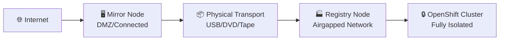
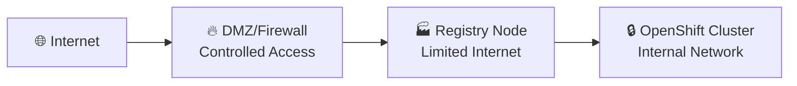
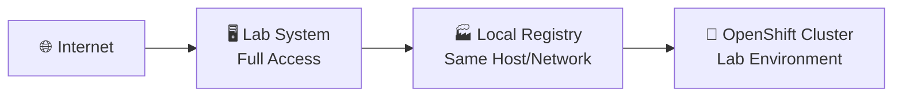

# Environment Profiles - Choose Your Deployment Pattern

## 🎯 **Select Your Environment Type**

Different environments require different approaches. Choose the profile that matches your hackathon scenario or production deployment.

## 🏗️ **Profile Matrix**

| Environment | Connectivity | Registry | Transport | Best For |
|------------|-------------|----------|-----------|----------|
| **🔒 Fully Airgapped** | None | Disconnected | Physical Media | Production, High Security |
| **🌐 Semi-Connected** | Limited | Connected/Disconnected | Network Transfer | Hybrid, Controlled Access |
| **🔗 Connected Lab** | Full Internet | Any | Direct/Network | Development, Testing |

## 🔒 **Profile 1: Fully Airgapped Environment**

### **Architecture:**


### **Characteristics:**
- **Mirror Node**: Connected to internet for content download
- **Registry Node**: Completely isolated, no internet access
- **Transport**: Physical media (USB drives, DVDs, tape)
- **Security**: Highest, complete air-gap isolation

### **Recommended Flows:**
1. **[Mirror-to-Disk](flows/10-mirror-to-disk.md)** (on Mirror Node)
2. **Physical transport** of delivery archives
3. **[From-Disk-to-Registry](flows/11-from-disk-to-registry.md)** (on Registry Node)

### **Considerations:**
- ✅ **Highest Security**: Complete isolation from external networks
- ✅ **Compliance**: Meets strictest regulatory requirements
- ⚠️ **Transport Complexity**: Physical media handling required
- ⚠️ **Update Latency**: Manual process for content updates

## 🌐 **Profile 2: Semi-Connected Environment**

### **Architecture:**


### **Characteristics:**
- **Registry Node**: Limited internet access through firewall/proxy
- **Connectivity**: Outbound HTTPS to specific registries only
- **Transport**: Direct network transfer with restrictions
- **Security**: High, controlled internet access

### **Recommended Flows:**
1. **[Mirror-to-Registry](flows/12-mirror-to-registry.md)** (direct pull-through)
2. **Alternative**: [Mirror-to-Disk](flows/10-mirror-to-disk.md) + [From-Disk-to-Registry](flows/11-from-disk-to-registry.md)

### **Considerations:**
- ✅ **Operational Efficiency**: Direct updates possible
- ✅ **Reduced Transport**: No physical media required
- ⚠️ **Network Dependencies**: Requires reliable filtered internet
- ⚠️ **Security Trade-offs**: Some external connectivity required

## 🔗 **Profile 3: Connected Lab Environment**

### **Architecture:**


### **Characteristics:**
- **Single/Few Hosts**: Mirror and registry on same system
- **Full Connectivity**: Unrestricted internet access
- **Transport**: Local or fast network transfer
- **Security**: Lower, optimized for learning and testing

### **Recommended Flows:**
1. **[Mirror-to-Registry](flows/12-mirror-to-registry.md)** (fastest for labs)
2. **Learning**: Try all flows to understand differences

### **Considerations:**
- ✅ **Simplicity**: Single host reduces complexity
- ✅ **Speed**: Direct operations, no transport delays
- ✅ **Learning**: Easy to experiment with different approaches
- ⚠️ **Not Production**: Security model not suitable for production

## 🗂️ **Storage Profiles by Environment**

### **Fully Airgapped Storage Requirements:**
```bash
# Mirror Node (Connected)
WORKSPACE_SIZE="50GB"      # Metadata and working files
CACHE_SIZE="200GB"         # Performance optimization
DELIVERY_SIZE="500GB"      # Transport archives

# Registry Node (Airgapped)  
REGISTRY_SIZE="1TB"        # Mirrored content storage
WORKSPACE_SIZE="10GB"      # Registry-side operations
```

### **Semi-Connected Storage Requirements:**
```bash
# Single Registry Node
REGISTRY_SIZE="1TB"        # Mirrored content
WORKSPACE_SIZE="50GB"      # Operations and cache
TEMP_SIZE="200GB"          # Optional delivery staging
```

### **Lab Environment Storage:**
```bash
# Single Lab Host
COMBINED_SIZE="500GB"      # Registry + workspace + cache
TEMP_SIZE="100GB"          # Experimental deliveries
```

## 🌐 **Network Profiles**

### **Fully Airgapped Network:**
```bash
# Mirror Node Requirements
OUTBOUND_443=true          # HTTPS to Red Hat registries
OUTBOUND_80=false          # HTTP not required (security)
PROXY_SUPPORT=optional    # If corporate proxy required

# Registry Node Requirements  
INBOUND_8443=true          # Registry serving port
OUTBOUND_INTERNET=false    # No internet access
INTERNAL_DNS=required      # Cluster node resolution
```

### **Semi-Connected Network:**
```bash
# Registry Node Requirements
OUTBOUND_443=limited       # Specific registry endpoints only
INBOUND_8443=true         # Registry serving
PROXY_SUPPORT=likely     # Common in semi-connected environments
FIREWALL_RULES=specific   # Whitelist approach
```

### **Lab Network:**
```bash
# Lab Environment
OUTBOUND_443=true         # Full internet access
INBOUND_8443=true         # Registry access
INTERNAL_ACCESS=full      # No network restrictions
```

## 🔐 **Security Profiles**

### **High Security (Airgapped):**
- ✅ **TLS Required**: All communications encrypted
- ✅ **Certificate Validation**: Proper CA chains
- ✅ **Access Controls**: RBAC, authentication required
- ✅ **Audit Logging**: Full operation logging
- ✅ **Physical Security**: Secure transport protocols

### **Medium Security (Semi-Connected):**
- ✅ **TLS Preferred**: Encrypted where possible
- ⚠️ **Controlled Access**: Limited internet, specific endpoints
- ✅ **Authentication**: Registry and cluster access controls
- ✅ **Monitoring**: Network and access monitoring

### **Lab Security (Connected):**
- ⚠️ **TLS Optional**: May use HTTP for simplicity
- ⚠️ **Open Access**: Simplified authentication
- ✅ **Learning Focus**: Security awareness without complexity

## 🎯 **Profile Selection Guide**

### **Choose Fully Airgapped If:**
- ✅ Production environment with strict security requirements
- ✅ Regulatory compliance (FedRAMP, FISMA, etc.)
- ✅ No acceptable internet connectivity for registry host
- ✅ Physical security controls are manageable

### **Choose Semi-Connected If:**
- ✅ Controlled internet access is available and acceptable
- ✅ Need balance between security and operational efficiency
- ✅ Firewall/proxy infrastructure can support specific endpoints
- ✅ Regular updates are operationally important

### **Choose Connected Lab If:**
- ✅ Learning and development environment
- ✅ Testing and validation scenarios
- ✅ Proof-of-concept implementations  
- ✅ Training and hackathon scenarios

## 🚀 **Next Steps by Profile**

### **After Selecting Your Profile:**
1. **Review Conventions**: [04-conventions.md](04-conventions.md) - Variables and paths
2. **Environment Validation**: [checklists/prereqs-ready.md](checklists/prereqs-ready.md)
3. **Choose Flow**: Select appropriate workflow from [00-overview.md](00-overview.md)

### **Profile-Specific Flow Recommendations:**

#### **Fully Airgapped → Recommended Sequence:**
1. [Mirror-to-Disk](flows/10-mirror-to-disk.md)
2. [From-Disk-to-Registry](flows/11-from-disk-to-registry.md)
3. [Cluster Upgrade](flows/20-cluster-upgrade.md) (if needed)
4. [Delete Workflow](flows/13-delete.md) (maintenance)

#### **Semi-Connected → Recommended Sequence:**
1. [Mirror-to-Registry](flows/12-mirror-to-registry.md)
2. [Cluster Upgrade](flows/20-cluster-upgrade.md) (if needed)  
3. [Delete Workflow](flows/13-delete.md) (maintenance)

#### **Connected Lab → Try All Flows:**
1. Start with [Mirror-to-Registry](flows/12-mirror-to-registry.md) (fastest)
2. Experiment with [Mirror-to-Disk](flows/10-mirror-to-disk.md) (learn transport)
3. Practice [Delete Workflow](flows/13-delete.md) (safe in lab)

---

**💡 Pro Tip**: Start with a lab environment to understand the concepts, then apply the same knowledge to your target production profile. The workflow patterns are consistent across all profiles.
