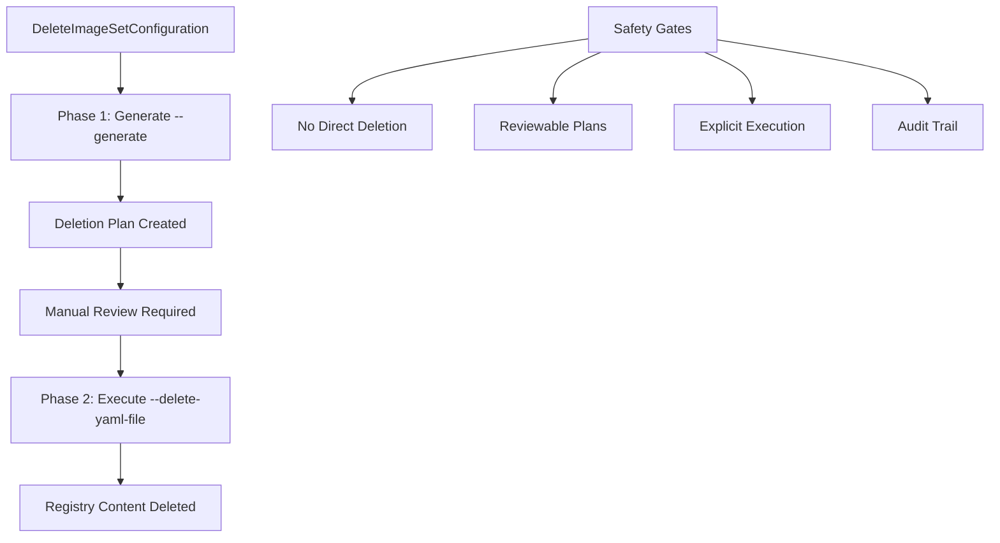

# Image Deletion Technical Reference

## 🎯 **Comprehensive oc-mirror v2 Deletion Architecture**

Deep technical reference for oc-mirror v2 deletion capabilities, safety mechanisms, and enterprise deployment patterns for registry maintenance.

## 🏗️ **Deletion Architecture Overview**

### **Two-Phase Safety Design**
oc-mirror v2 implements a **mandatory two-phase approach** that provides enterprise-grade safety:



### **Safety Mechanisms Built-In**
- ✅ **No Direct Deletion**: Cannot delete without generating reviewable plan first
- ✅ **Forced Review Step**: Must explicitly use `--delete-yaml-file` to execute  
- ✅ **Persistent Audit Trail**: Generated plans serve as rollback reference
- ✅ **Precise Control**: Can modify generated deletion plan before execution
- ✅ **Workspace Validation**: Requires original mirror workspace with graph data

## 📂 **Deletion Data Architecture**

### **Required Workspace Structure**
```bash
# Critical requirement: Original mirror workspace with graph data
$WS/working-dir/
├── hold-release/
│   └── cincinnati-graph-data.json    # Required for platform deletions
├── cluster-resources/                 # Generated cluster configs
└── delete/                           # Generated deletion plans
    └── delete-images.yaml            # Reviewable deletion plan
```

### **Workspace Dependency Pattern**
| Operation | Workspace Requirement | Reason |
|-----------|----------------------|---------|
| **Delete Generate** | Original mirror workspace | Cincinnati graph data required |
| **Delete Execute** | Generated deletion plan | Safety: explicit execution only |
| **Mirror Operations** | Fresh or existing workspace | Standard operations |

### **Critical Architecture Rule**
**🚨 Delete operations MUST use the original mirror workspace (`file://$WS`), not a separate delete workspace. The Cincinnati graph data in `working-dir/hold-release/` is essential for platform deletions.**

## ⚙️ **Delete Configuration Architecture**

### **DeleteImageSetConfiguration Structure**
```yaml
apiVersion: mirror.openshift.io/v2alpha1
kind: DeleteImageSetConfiguration
delete:                               # Note: 'delete' not 'mirror'
  platform:                          # Platform release deletions
    channels:
    - name: stable-4.19
      minVersion: 4.19.2             # Oldest version TO DELETE
      maxVersion: 4.19.6             # Newest version TO DELETE
    graph: true                      # Required for platform deletions
  
  # Optional: Operator deletions
  operators:
  - catalog: registry.redhat.io/redhat/redhat-operator-index:v4.19
    packages:
    - name: outdated-operator
      
  # Optional: Additional image deletions
  additionalImages:
  - name: registry.redhat.io/ubi8/ubi:old-version
```

### **Configuration Safety Patterns**

#### **Safe Version Range Strategy**
```bash
# Determine current cluster version first
CURRENT_VERSION=$(oc get clusterversion -o jsonpath='{.items[0].status.desired.version}')
echo "Current cluster version: $CURRENT_VERSION"

# Safe deletion: Only target versions OLDER than current
# If current is 4.19.7, safe to delete 4.19.2-4.19.6
export DELETE_MIN_VERSION="4.19.2"
export DELETE_MAX_VERSION="4.19.6"  # Less than current 4.19.7
```

#### **Enterprise Deletion Planning**
```bash
# Multi-cluster environment considerations
# 1. Inventory all clusters using the registry
# 2. Determine minimum version across all clusters  
# 3. Only delete versions older than minimum cluster version
# 4. Plan for future upgrade paths

CLUSTER_VERSIONS=(
    "cluster-prod-1: 4.19.7"
    "cluster-dev-1: 4.19.5"     # Minimum version
    "cluster-test-1: 4.19.7"
)

MIN_VERSION="4.19.5"
SAFE_DELETE_MAX="4.19.4"  # Only delete versions older than minimum
```

## 🔄 **Deletion Process Architecture**

### **Phase 1: Generate Deletion Plan**
```bash
# Using canonical variables from 04-conventions.md
oc mirror delete \
    -c "$DELETE_ISC" \
    --generate \
    --workspace file://"$WS" \        # Must use original mirror workspace
    "$REGISTRY_DOCKER" \
    --v2 \
    --cache-dir "$CACHE"

# Generated artifacts:
# - $WS/working-dir/delete/delete-images.yaml (reviewable plan)
# - Operation logs for audit trail
```

### **Phase 2: Plan Review & Analysis**
```bash
# Deletion plan analysis
DELETION_PLAN="$WS/working-dir/delete/delete-images.yaml"

echo "=== Deletion Plan Analysis ==="
echo "Plan location: $DELETION_PLAN"
echo "Images to delete: $(grep -c 'imageName:' "$DELETION_PLAN")"
echo "Registries affected: $(grep -c 'registry:' "$DELETION_PLAN")"
echo "Plan size: $(du -sh "$DELETION_PLAN" | cut -f1)"

# Review specific deletion targets
echo "Release versions to delete:"
grep 'imageName.*release-images' "$DELETION_PLAN" | sed 's/.*release-images:\(.*\)-x86_64.*/\1/' | sort -V
```

### **Phase 3: Execution**
```bash
# Execute deletion using reviewed plan
oc mirror delete \
    --delete-yaml-file "$DELETION_PLAN" \
    "$REGISTRY_DOCKER" \
    --v2 \
    --cache-dir "$CACHE" \
    --force-cache-delete    # Optional: clean cache during deletion

echo "Deletion execution initiated..."
```

## 🛡️ **Enterprise Safety Framework**

### **Pre-Deletion Validation Checklist**

#### **Cluster Impact Assessment**
```bash
#!/bin/bash
# Pre-deletion cluster validation script

echo "=== Cluster Impact Assessment ==="

# 1. Check current cluster versions
echo "Current cluster versions:"
oc get clusterversion -o jsonpath='{.items[0].status.history[*].version}' | tr ' ' '\n' | sort -V | tail -5

# 2. Verify no active upgrades
UPGRADE_PROGRESSING=$(oc get clusterversion -o jsonpath='{.items[0].status.conditions[?(@.type=="Progressing")].status}')
[[ "$UPGRADE_PROGRESSING" == "False" ]] && echo "✅ No upgrade in progress" || echo "⚠️ Upgrade may be in progress"

# 3. Check registry mirror configuration
MIRROR_CONFIG_COUNT=$(oc get imagecontentsourcepolicy,imagedigestmirrorset --no-headers 2>/dev/null | wc -l)
[[ $MIRROR_CONFIG_COUNT -gt 0 ]] && echo "✅ Mirror configuration present ($MIRROR_CONFIG_COUNT policies)" || echo "❌ No mirror configuration found"

# 4. Test registry connectivity from cluster nodes
echo "Testing registry connectivity from cluster..."
oc debug node/$(oc get nodes -o jsonpath='{.items[0].metadata.name}') -- \
  chroot /host podman pull "$REGISTRY_FQDN/openshift/release-images:$CURRENT_VERSION-x86_64" --tls-verify=false \
  >/dev/null 2>&1 && echo "✅ Registry accessible from cluster" || echo "❌ Registry not accessible from cluster"
```

#### **Multi-Cluster Coordination**
```bash
#!/bin/bash
# Multi-cluster deletion safety script

CLUSTERS=("prod-cluster" "dev-cluster" "test-cluster")
REGISTRY_FQDN="mirror-registry.example.com:8443"

echo "=== Multi-Cluster Deletion Safety Check ==="

for cluster in "${CLUSTERS[@]}"; do
    echo "Checking cluster: $cluster"
    
    # Switch context (adjust for your cluster management method)
    oc config use-context "$cluster"
    
    # Get cluster version
    CLUSTER_VERSION=$(oc get clusterversion -o jsonpath='{.items[0].status.desired.version}' 2>/dev/null)
    echo "  Current version: $CLUSTER_VERSION"
    
    # Check if cluster uses our mirror registry
    USES_MIRROR=$(oc get imagecontentsourcepolicy,imagedigestmirrorset -o yaml 2>/dev/null | grep -c "$REGISTRY_FQDN" || echo 0)
    [[ $USES_MIRROR -gt 0 ]] && echo "  Mirror usage: Yes" || echo "  Mirror usage: No"
    
    echo ""
done

echo "⚠️ Only delete versions older than the MINIMUM version across ALL clusters"
```

### **Enterprise Deletion Workflow**

#### **Staged Deletion Process**
```bash
#!/bin/bash
# Enterprise staged deletion workflow

# Stage 1: Test environment deletion (lowest risk)
echo "Stage 1: Test environment deletion"
export DELETE_MIN_VERSION="4.19.2"
export DELETE_MAX_VERSION="4.19.3"  # Conservative start
# Execute deletion on test registry

# Stage 2: Development environment (medium risk)
echo "Stage 2: Development environment deletion"  
export DELETE_MAX_VERSION="4.19.4"  # Expand range
# Execute deletion on dev registry

# Stage 3: Production environment (highest risk)
echo "Stage 3: Production environment deletion"
export DELETE_MAX_VERSION="4.19.6"  # Full planned range
# Execute deletion on production registry with full safety checks
```

#### **Rollback Strategy**
```bash
#!/bin/bash  
# Deletion rollback strategy (restore from backup)

# Pre-deletion: Create registry backup
echo "Creating pre-deletion registry backup..."
# Registry-specific backup commands here

# Post-deletion: Validate and prepare rollback
echo "Deletion rollback procedure:"
echo "1. Stop registry service"
echo "2. Restore registry data from backup"  
echo "3. Restart registry service"
echo "4. Validate restored content"
echo "5. Update cluster configurations if needed"

# Automated rollback script ready for emergency use
```

## 🔍 **Advanced Troubleshooting**

### **Deletion Failure Analysis**

#### **NoGraphData Error Resolution**
```bash
# Problem: "NoGraphData: No graph data found on disk"
# Root Cause: Using separate workspace instead of original mirror workspace
# Solution: Use original mirror workspace with Cincinnati graph data

# Verify graph data exists
ls -la "$WS/working-dir/hold-release/cincinnati-graph-data.json"

# Correct deletion command
oc mirror delete \
    --workspace file://"$WS" \      # Use ORIGINAL mirror workspace
    -c "$DELETE_ISC" \
    --generate
```

#### **Authentication & Permission Issues**
```bash
# Registry authentication diagnostics
echo "=== Registry Authentication Diagnostics ==="

# 1. Test registry API access
curl -sk https://"$REGISTRY_FQDN"/v2/ && echo "✅ Registry API accessible" || echo "❌ Registry API failed"

# 2. Verify authentication
podman login --get-login "$REGISTRY_FQDN" && echo "✅ Authentication valid" || echo "❌ Authentication failed"

# 3. Test delete permissions (if supported by registry)
# This is registry-specific - consult registry documentation

# 4. Check registry logs for deletion attempts
echo "Check registry logs at: /opt/quay/logs/ (for mirror-registry)"
```

#### **Workspace & Graph Data Issues**
```bash
# Workspace diagnostic script
echo "=== Workspace Diagnostic ==="

# 1. Verify workspace structure
[[ -d "$WS/working-dir" ]] && echo "✅ Workspace working-dir exists" || echo "❌ Workspace working-dir missing"

# 2. Check Cincinnati graph data
GRAPH_FILE="$WS/working-dir/hold-release/cincinnati-graph-data.json"
[[ -f "$GRAPH_FILE" ]] && echo "✅ Cincinnati graph data exists" || echo "❌ Cincinnati graph data missing"

# 3. Validate graph data content
[[ -f "$GRAPH_FILE" ]] && jq . "$GRAPH_FILE" >/dev/null && echo "✅ Graph data valid JSON" || echo "❌ Graph data corrupted"

# 4. Check cluster resources
CLUSTER_RESOURCES_DIR="$WS/working-dir/cluster-resources"
[[ -d "$CLUSTER_RESOURCES_DIR" ]] && echo "✅ Cluster resources exist" || echo "⚠️ No cluster resources"
```

## 📊 **Performance & Impact Analysis**

### **Deletion Performance Metrics**
```bash
# Deletion operation timing (measured values)
Operation Type                  Duration        Registry Impact
Small deletion (1-2 versions)  5-10 minutes   Minimal disruption
Medium deletion (3-5 versions) 15-30 minutes  Temporary slowdown
Large deletion (5+ versions)   30-60 minutes  Noticeable impact
Enterprise deletion (multi-op)  1-2 hours     Plan maintenance window
```

### **Registry Storage Impact**
```bash
# Storage reclamation analysis
echo "=== Registry Storage Analysis ==="

# Before deletion
BEFORE_SIZE=$(df -h /opt/quay | tail -1 | awk '{print $3}')
echo "Registry size before deletion: $BEFORE_SIZE"

# Execute deletion...

# After deletion (before GC)
AFTER_SIZE=$(df -h /opt/quay | tail -1 | awk '{print $3}')
echo "Registry size after deletion (before GC): $AFTER_SIZE"

echo "⚠️ Note: Storage reclamation requires registry garbage collection"
echo "Run GC command: sudo podman exec -it quay-app registry-garbage-collect"
```

### **Network & Resource Impact**
```bash
# Monitor deletion resource usage
echo "=== Deletion Resource Monitoring ==="

# CPU usage during deletion
echo "CPU usage:"
top -bn1 | grep "oc-mirror" || echo "No oc-mirror processes active"

# Network traffic
echo "Network connections:"
netstat -an | grep ":8443" | wc -l

# Registry service health
echo "Registry service:"
systemctl is-active quay-app && echo "✅ Registry healthy" || echo "❌ Registry issues"
```

## 🚀 **Automation & Integration Patterns**

### **CI/CD Integration**
```bash
#!/bin/bash
# Automated deletion pipeline integration

# 1. Validation stage
echo "Pipeline Stage 1: Validation"
./validate-deletion-safety.sh || exit 1

# 2. Generate stage  
echo "Pipeline Stage 2: Generate deletion plan"
oc mirror delete -c "$DELETE_ISC" --generate --workspace file://"$WS" "$REGISTRY_DOCKER" --v2

# 3. Approval gate (manual or automated)
echo "Pipeline Stage 3: Approval required"
# Integration with approval systems (GitHub, GitLab, etc.)

# 4. Execution stage
echo "Pipeline Stage 4: Execute deletion"
oc mirror delete --delete-yaml-file "$DELETION_PLAN" "$REGISTRY_DOCKER" --v2

# 5. Validation stage
echo "Pipeline Stage 5: Post-deletion validation"
./validate-deletion-success.sh
```

### **Enterprise Monitoring Integration**
```bash
#!/bin/bash
# Enterprise monitoring integration

# Metrics collection
DELETION_START_TIME=$(date +%s)
IMAGES_DELETED=$(grep -c 'imageName:' "$DELETION_PLAN")

# Execute deletion with monitoring
oc mirror delete --delete-yaml-file "$DELETION_PLAN" "$REGISTRY_DOCKER" --v2

DELETION_END_TIME=$(date +%s)
DELETION_DURATION=$((DELETION_END_TIME - DELETION_START_TIME))

# Send metrics to monitoring system
curl -X POST "$MONITORING_ENDPOINT" \
    -d "deletion_duration=$DELETION_DURATION" \
    -d "images_deleted=$IMAGES_DELETED" \
    -d "registry=$REGISTRY_FQDN" \
    -d "timestamp=$(date -Iseconds)"

echo "Deletion metrics sent to monitoring system"
```

## 📋 **Complete Command Reference**

### **Generation Commands**
```bash
# Basic deletion plan generation
oc mirror delete -c "$DELETE_ISC" --generate --workspace file://"$WS" "$REGISTRY_DOCKER" --v2

# With custom cache directory
oc mirror delete -c "$DELETE_ISC" --generate --workspace file://"$WS" "$REGISTRY_DOCKER" --v2 --cache-dir "$CACHE"

# With debugging
oc mirror delete -c "$DELETE_ISC" --generate --workspace file://"$WS" "$REGISTRY_DOCKER" --v2 --log-level debug

# With custom authentication
oc mirror delete -c "$DELETE_ISC" --generate --workspace file://"$WS" "$REGISTRY_DOCKER" --v2 --authfile /custom/auth.json
```

### **Execution Commands**
```bash
# Basic deletion execution
oc mirror delete --delete-yaml-file "$DELETION_PLAN" "$REGISTRY_DOCKER" --v2

# With cache cleanup
oc mirror delete --delete-yaml-file "$DELETION_PLAN" "$REGISTRY_DOCKER" --v2 --force-cache-delete

# With signature deletion
oc mirror delete --delete-yaml-file "$DELETION_PLAN" "$REGISTRY_DOCKER" --v2 --delete-signatures

# Production execution with all options
oc mirror delete \
    --delete-yaml-file "$DELETION_PLAN" \
    "$REGISTRY_DOCKER" \
    --v2 \
    --cache-dir "$CACHE" \
    --force-cache-delete \
    --authfile /prod/auth.json \
    --log-level info
```

### **Validation Commands**
```bash
# Pre-deletion validation
oc adm release info "$REGISTRY_DOCKER/openshift/release-images:$VERSION-x86_64"

# Post-deletion validation (should fail for deleted versions)
oc adm release info "$REGISTRY_DOCKER/openshift/release-images:$DELETED_VERSION-x86_64" 2>&1 | grep -q "deleted or has expired"

# Registry health check
curl -sk https://"$REGISTRY_FQDN"/v2/ | jq '.'

# Registry content inventory
curl -sk https://"$REGISTRY_FQDN"/v2/openshift/release-images/tags/list | jq -r '.tags[]' | grep x86_64 | sort -V
```

## 🔗 **Framework Integration**

### **Integration with Operational Flows**

#### **[Delete Workflow](../flows/13-delete.md) Connection**
This reference provides technical depth for the operational delete workflow:
- **Phase 1 Details**: Technical architecture behind `--generate` safety
- **Phase 2 Details**: Deep analysis of generated deletion plans  
- **Phase 3 Details**: Execution mechanics and monitoring

#### **[Cache Management](cache-management.md) Connection**
- **Cache Behavior**: Delete operations do NOT automatically clean cache
- **Manual Cleanup**: Use `--force-cache-delete` or manual cache removal
- **Performance Impact**: Cache preserved for optimal subsequent operations

### **Prerequisites Integration**
- **Shared Prerequisites**: [02-shared-prereqs.md](../02-shared-prereqs.md) covers registry and authentication setup
- **Canonical Variables**: [04-conventions.md](../04-conventions.md) provides standard variable definitions
- **Environment Profiles**: [03-env-profiles.md](../03-env-profiles.md) guides deployment pattern selection

---

## 💡 **Enterprise Key Takeaways**

### **Safety Architecture**
1. **Two-Phase Mandatory**: Generate → Review → Execute pattern prevents accidents
2. **Workspace Dependency**: Must use original mirror workspace with graph data
3. **Explicit Execution**: No direct deletion - must use generated plan
4. **Audit Trail**: Generated plans provide compliance documentation

### **Operational Excellence**  
- **Pre-Validation**: Always validate cluster versions and registry usage
- **Staged Approach**: Test → Development → Production deletion workflow
- **Monitoring Integration**: Track deletion metrics and impact
- **Rollback Planning**: Prepare registry backup and restoration procedures

### **Technical Requirements**
- **Graph Data**: Cincinnati graph data required for platform deletions
- **Authentication**: Delete permissions required on target registry
- **Storage Planning**: Plan for registry garbage collection post-deletion
- **Multi-Cluster Coordination**: Consider all clusters using the registry

**⚠️ Enterprise Warning**: Always test deletion procedures in non-production environments first. The two-phase approach provides excellent safety, but proper validation and rollback planning are essential for enterprise deployments.
