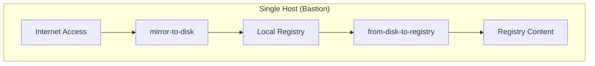
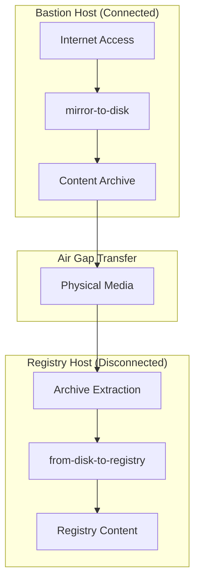

# oc-mirror Architecture Patterns & Design Considerations

**Critical Decision Guide for Registry Deployment Patterns**

⚠️ **Important:** This document addresses fundamental architectural decisions that affect all oc-mirror workflows. **Read this before selecting your mirroring approach.**

---

## 🏗️ The Registry Location Decision

### **The Core Question**
**Where should your mirror registry run?**

This seemingly simple question affects:
- Network architecture requirements
- Security boundaries  
- Operational complexity
- Content transfer procedures
- Host resource requirements

### **Current Documentation Gap** 
⚠️ **Known Issue:** Our current flow documentation makes assumptions about registry location that may not match your environment. This document identifies these gaps and provides guidance while we improve the documentation.

---

## 🎯 Architecture Pattern Overview

### **Pattern A: Single-Host (Registry on Bastion)**

**Characteristics:**
- **One host** handles both download and registry functions
- **Simplified networking** - no content transfer between hosts
- **Direct process** - mirror-to-disk → from-disk-to-registry on same host
- **Registry accessible** from external networks for cluster installation

### **Pattern B: Two-Host (Registry on Registry Node)**

**Characteristics:**
- **Two hosts** with separated functions (bastion + registry)
- **True air-gap** simulation with physical content transfer
- **Role separation** - download host vs registry host
- **Network isolation** - registry host has no internet access

---

## 📊 Pattern Comparison Matrix

| Aspect | Single-Host (A) | Two-Host (B) |
|--------|----------------|-------------|
| **Hosts Required** | 1 | 2 |
| **Network Requirements** | Internet + Registry Access | Internet (bastion) + Isolated (registry) |  
| **Air-Gap Simulation** | Partial | Complete |
| **Content Transfer** | None (local) | Physical media |
| **Operational Complexity** | Lower | Higher |
| **Resource Requirements** | Higher per host | Distributed |
| **Security Boundaries** | Single zone | Multiple zones |
| **Setup Time** | Faster | Slower |
| **Production Realism** | Good for testing | High fidelity |

---

## 🎯 Decision Guidance

### **Choose Single-Host When:**
- ✅ **Testing/Development** environments
- ✅ **Proof of concept** deployments  
- ✅ **Single network zone** constraints
- ✅ **Resource limitations** (fewer hosts available)
- ✅ **Simplified operations** preferred
- ✅ **Semi-connected** environments (some internet access)

### **Choose Two-Host When:**
- ✅ **Production air-gap** simulation required
- ✅ **Security requirements** mandate role separation
- ✅ **True disconnected** registry host needed
- ✅ **Multiple network zones** available
- ✅ **High-fidelity testing** of air-gap procedures
- ✅ **Training purposes** for air-gap workflows

---

## 🚧 Current Documentation Status

### **What Works Today:**
- ✅ **mirror-to-disk.md** - Works for both patterns (download phase)
- ✅ **mirror-to-registry.md** - Single-host direct mirroring
- ✅ **Infrastructure setup** - AWS two-host configuration

### **Known Gaps & Assumptions:**
- ⚠️ **from-disk-to-registry.md** - Currently assumes Pattern B (two-host)
- ⚠️ **Flow decision matrix** - Doesn't clearly distinguish patterns
- ⚠️ **Architecture guidance** - Buried in individual flows
- ⚠️ **Single-host procedures** - Incomplete in from-disk-to-registry flow

### **Incomplete/Reference Material:**
- 📋 **airgap-testing.md** - Contains patterns but needs organization
- 📋 **sequential-mirroring.md** - Multi-step workflows need integration
- 📋 **Pattern-specific procedures** - Need extraction and refinement

---

## 🛠️ Development Roadmap

### **High Priority (Immediate)**
- [ ] **Enhance from-disk-to-registry.md** - Support both architecture patterns
- [ ] **Create architecture decision section** - Clear pattern selection guidance
- [ ] **Update flow README** - Include pattern considerations in decision matrix
- [ ] **Test single-host procedures** - Validate simplified workflow

### **Medium Priority (Short Term)**  
- [ ] **Extract patterns from airgap-testing.md** - Organize into coherent guidance
- [ ] **Refine sequential-mirroring content** - Integrate with pattern-specific flows
- [ ] **Create pattern-specific examples** - Show concrete implementation differences
- [ ] **Validate two-host procedures** - Ensure current documentation accuracy

### **Lower Priority (Long Term)**
- [ ] **Advanced patterns** - Hub-and-spoke, multiple registries, hybrid approaches
- [ ] **Automation considerations** - CI/CD integration for different patterns
- [ ] **Enterprise patterns** - Large-scale deployment considerations
- [ ] **Performance optimization** - Pattern-specific tuning guidance

---

## 💡 Implementation Notes

### **For Users Today:**
1. **Read this document first** before selecting flows
2. **Choose your pattern** based on decision guidance above
3. **Follow appropriate flows** with pattern in mind:
   - Single-host: mirror-to-disk → from-disk-to-registry (same host)
   - Two-host: mirror-to-disk (bastion) → transfer → from-disk-to-registry (registry host)

### **For Contributors:**
1. **Avoid pattern assumptions** in flow documentation
2. **Call out architectural decisions** explicitly  
3. **Test both patterns** when validating procedures
4. **Update this document** as patterns evolve

---

## 🔗 Related Documentation

### **Current Flows:**
- **[mirror-to-disk.md](flows/mirror-to-disk.md)** - Download phase (pattern-agnostic)
- **[from-disk-to-registry.md](flows/from-disk-to-registry.md)** - Upload phase (needs pattern awareness)
- **[mirror-to-registry.md](flows/mirror-to-registry.md)** - Direct mirroring (single-host only)

### **Infrastructure Setup:**
- **[AWS Lab Infrastructure](setup/aws-lab-infrastructure.md)** - Two-host setup
- **[oc-mirror Workflow](setup/oc-mirror-workflow.md)** - Complete workflow (mixed patterns)

### **Reference Material:**
- **[airgap-testing.md](reference/airgap-testing.md)** - Testing patterns and procedures
- **[sequential-mirroring.md](reference/workflows/sequential-mirroring.md)** - Multi-step workflows

---

## 🎯 Key Takeaways

1. **Architecture matters** - Registry location affects everything
2. **No one-size-fits-all** - Choose pattern based on your environment
3. **Documentation evolving** - We're improving pattern-specific guidance
4. **Test your pattern** - Validate procedures match your chosen architecture
5. **Feedback welcome** - Help us improve pattern-specific documentation

---

*This document will be updated as we improve pattern-specific documentation and procedures. Check back regularly for updates to development roadmap and implementation guidance.*
