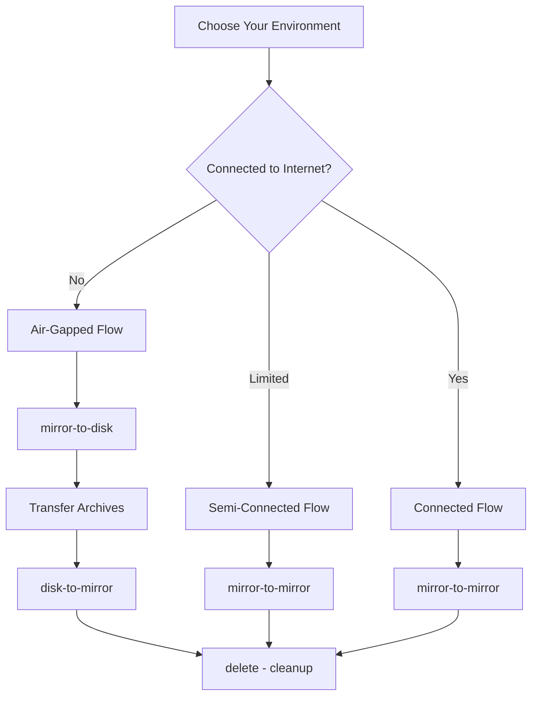

# oc-mirror --v2 Flow Patterns

**Choose Your oc-mirror Journey**

This directory contains the core **flow patterns** for oc-mirror --v2, designed for hackathon participants to understand and implement different mirroring scenarios.

## 🎯 **Available Flows**

| Flow | Environment | Use Case | Complexity |
|------|-------------|----------|------------|
| **[mirror-to-disk.md](mirror-to-disk.md)** | Connected | Create portable archives | ⭐⭐ |
| **[disk-to-mirror.md](disk-to-mirror.md)** | Disconnected | Deploy from archives | ⭐⭐ |
| **[mirror-to-mirror.md](mirror-to-mirror.md)** | Semi-connected | Direct mirroring | ⭐ |
| **[delete.md](delete.md)** | Any | Safe content cleanup | ⭐⭐⭐ |

## 🤔 **Which Flow Do I Need?**

### **Air-Gapped Environment (No Internet)**
1. **Connected Phase:** Use [mirror-to-disk.md](mirror-to-disk.md)
2. **Transfer Phase:** Move archives to disconnected environment  
3. **Disconnected Phase:** Use [disk-to-mirror.md](disk-to-mirror.md)

### **Semi-Connected Environment (Limited Internet)**
- **Direct Mirroring:** Use [mirror-to-mirror.md](mirror-to-mirror.md)

### **Content Cleanup (Any Environment)**
- **Delete Old Versions:** Use [delete.md](delete.md)

## 🏗️ **Flow Architecture**

## 🚀 **Getting Started**

### **Prerequisites**
- Complete [../setup/](../setup/) - Environment preparation
- Review [../guides/collect-ocp.md](../guides/collect-ocp.md) - Tool installation

### **Flow Selection Process**
1. **Assess your environment** (connected, semi-connected, air-gapped)
2. **Choose appropriate flow** from table above
3. **Follow step-by-step procedures** in selected flow document
4. **Use provided scripts** from `oc-mirror-master/` directory

## 📚 **Related Documentation**

### **Foundation**
- **[../setup/](../setup/)** - Initial environment setup
- **[../guides/](../guides/)** - Step-by-step operational guides

### **Advanced**
- **[../reference/](../reference/)** - Technical references and troubleshooting
- **[../reference/workflows/](../reference/workflows/)** - Enterprise operational patterns

### **Scripts**
- **[../../oc-mirror-master/](../../oc-mirror-master/)** - Ready-to-use implementation scripts

---

## 🚧 **Hackathon Development Status**

Flow development progress for the oc-mirror hackathon:

- **✅ delete.md** - Complete with tested procedures
- **✅ mirror-to-disk.md** - Complete with tested procedures from oc-mirror-workflow
- **✅ disk-to-mirror.md** - Complete with tested procedures from oc-mirror-workflow  
- **✅ mirror-to-mirror.md** - Complete with tested procedures and decision guidance

**Status:** All core flows complete with comprehensive, tested procedures that hackathon participants can follow successfully.
