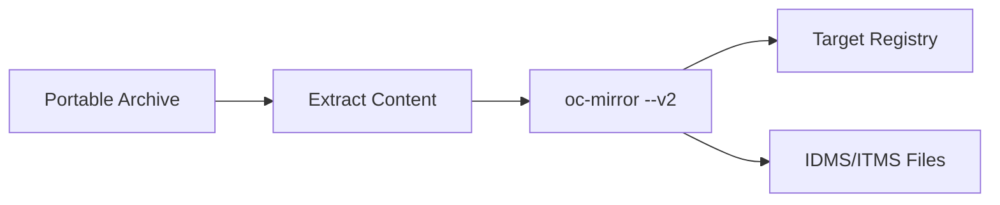

# From-Disk-to-Registry Flow

**oc-mirror --v2 Flow Pattern**

## Overview

The **from-disk-to-registry** flow uploads previously mirrored content from portable archives to a target registry in a disconnected environment. This is the second stage of the air-gapped mirroring process, deploying content that was packaged using the [mirror-to-disk.md](mirror-to-disk.md) flow.

## Use Cases

- **Air-gapped registry population** - Deploy content from portable archives
- **Disconnected mirror setup** - Initialize registries in isolated environments  
- **Content deployment** - Install pre-packaged OpenShift content bundles
- **Disaster recovery** - Restore registry content from backup archives
- **Multi-site distribution** - Deploy standardized content to multiple locations

## Flow Pattern



## Prerequisites

### System Requirements (Disconnected Host)
- **Linux System:** RHEL 9+, CentOS Stream, or compatible distribution
- **Storage:** 100+ GB available disk space for content extraction and caching
- **Memory:** 8+ GB RAM recommended for upload operations
- **Container Runtime:** Podman 4.0+ installed and configured
- **Network:** Access to target mirror registry (local network only)

### Required Components
- **Mirror Registry:** Running Quay or compatible container registry
- **Portable Archive:** Content archive from mirror-to-disk flow
- **oc-mirror:** OpenShift mirroring tool v2 (same version as mirror-to-disk)
- **Registry Authentication:** Valid credentials for target registry

### Registry Requirements
- **Running mirror registry** (see [mirror registry setup](../setup/oc-mirror-workflow.md#mirror-registry-setup))
- **Registry accessible** from disconnected host
- **Sufficient storage** for mirrored content (50+ GB)
- **Valid TLS certificates** (or registry configured for HTTP)

---

## System Preparation (Registry Node)

### Prerequisites Setup

**Important:** This runs on the **registry node** in your disconnected environment.

```bash
# Install required packages (RHEL/CentOS) 
sudo dnf install -y podman git jq vim wget curl tar

# Verify installations
podman --version
git --version
```

#### Set System Hostname
```bash
# Set proper hostname for your registry node
sudo hostnamectl set-hostname registry.example.com

# Verify hostname is set
hostname
```

#### Configure Local Firewall
Configure the firewall to allow registry access:

```bash
# Allow HTTP traffic (port 80)
sudo firewall-cmd --permanent --add-port=80/tcp

# Allow HTTPS traffic (port 443)  
sudo firewall-cmd --permanent --add-port=443/tcp

# Allow mirror registry traffic (port 8443)
sudo firewall-cmd --permanent --add-port=8443/tcp

# Reload firewall to apply changes
sudo firewall-cmd --reload

# Verify firewall rules
sudo firewall-cmd --list-ports
```

> 🛡️ **Security Note:** These firewall rules allow access from any source. In production environments, restrict access to specific IP ranges using `--source=IP_RANGE/CIDR`.

## OpenShift Tools Installation

### 1. Transfer and Extract Repository

**Note:** The repository should be transferred along with your content archive, or downloaded if connectivity allows.

```bash
# If repository archive was transferred:
tar -xzf oc-mirror-hackathon.tar.gz
cd oc-mirror-hackathon

# Or clone if network access available:
git clone https://github.com/RedHatGov/oc-mirror-hackathon.git
cd oc-mirror-hackathon
```

### 2. Install OpenShift Tools

For disconnected installations, tools should be transferred with content:

```bash
# If tools archive was transferred, extract it:
cd downloads/
tar -xzf openshift-tools.tar.gz

# Install all tools  
./install.sh
```

### 2.5. Hackathon-Specific oc-mirror v2 (OpenShift 4.20.0-ec.5)

**For exact hackathon version consistency** in disconnected environments:

```bash
# If hackathon oc-mirror was transferred with content archive:
cd downloads/

# Extract hackathon oc-mirror (should be in transferred archive)
tar -xzf oc-mirror-hackathon.rhel9.tar.gz 2>/dev/null || echo "Using existing oc-mirror"
chmod +x oc-mirror

# Install to PATH
sudo cp oc-mirror /usr/local/bin/
```

**OR, if limited internet connectivity is available:**

```bash
cd downloads/

# Download oc-mirror v2 from OpenShift 4.20.0-ec.5
echo "🔄 Downloading hackathon-specific oc-mirror v2..."
curl -L -o oc-mirror-hackathon.rhel9.tar.gz \
  "https://mirror.openshift.com/pub/openshift-v4/clients/ocp-dev-preview/4.20.0-ec.5/oc-mirror.rhel9.tar.gz"

# Backup existing and install hackathon version
mv oc-mirror oc-mirror-stable-backup 2>/dev/null || true
tar -xzf oc-mirror-hackathon.rhel9.tar.gz
chmod +x oc-mirror
sudo cp oc-mirror /usr/local/bin/
```

### 3. Verify Installation

```bash
# Verify hackathon version (4.20.0-ec.5)
oc-mirror --version

# Check basic functionality
oc-mirror --help
oc version  
```

## Mirror Registry Setup

### 1. Install Mirror Registry

Navigate to the mirror registry directory and run the installer:

```bash
# Change to mirror registry directory
cd ~/oc-mirror-hackathon/downloads/mirror-registry

# Install mirror registry
./mirror-registry install
```

> 📝 **Critical:** When the installation completes, **save the generated registry credentials** (username and password) from the last line of the log output.

### 2. Trust Registry SSL Certificate

Configure the system to trust the registry's self-signed certificate:

```bash
# Copy certificate to system trust store
sudo cp ~/quay-install/quay-rootCA/rootCA.pem /etc/pki/ca-trust/source/anchors/

# Update certificate trust
sudo update-ca-trust

# Verify certificate is trusted
curl -I https://$(hostname):8443
```

### 3. Configure Authentication

```bash
# Create container config directory (if not exists)
mkdir -p ~/.config/containers

# Login to your mirror registry (use credentials from installation)
podman login https://$(hostname):8443 \
  --username init \
  --password [YOUR_REGISTRY_PASSWORD]
```

### 4. Verify Registry Access

Test registry access:
- **Navigate to your registry URL:** `https://$(hostname):8443`
- **Login with your credentials** from the installation
- **Verify the registry interface loads**

---

## Configuration

### ImageSet Configuration

For reference, this flow uses content mirrored with this configuration:

```yaml
kind: ImageSetConfiguration
apiVersion: mirror.openshift.io/v1alpha2
# archiveSize: 8 # only used in mirror-to-disk flow 
mirror:
  platform:
    channels:
    - name: stable-4.19
      minVersion: 4.19.2
      maxVersion: 4.19.2 
    graph: true
  operators:
    - catalog: registry.redhat.io/redhat/redhat-operator-index:v4.19
      packages:
        - name: web-terminal
  additionalImages: 
    - name: registry.redhat.io/ubi9/ubi:latest
```

**Note:** This configuration is for reference only. The actual content comes from your transferred archive created by the mirror-to-disk flow.

---

## Content Transfer Process

### 1. Transfer Archive to Disconnected Environment

Using your organization's approved air-gap transfer method:

```bash
# Example: Physical media transfer
# - Copy oc-mirror-content-YYYYMMDD-HHMM.tar.gz to removable media
# - Transport to disconnected environment  
# - Copy archive to disconnected host

# Verify archive integrity
sha256sum -c oc-mirror-content-YYYYMMDD-HHMM.sha256
```

### 2. Extract Content Archive

```bash
# Navigate to working directory
cd ~/oc-mirror-hackathon/oc-mirror-master/

# Extract content archive
tar -xzf /path/to/oc-mirror-content-YYYYMMDD-HHMM.tar.gz

# Verify extraction
ls -la content/
ls -la content/working-dir/
```

**Extracted Components:**
- **content/working-dir/** - Essential metadata and Cincinnati graph data
- **content/images/** - OpenShift release images and manifests  
- **content/cluster-resources/** - IDMS/ITMS files for cluster installation

## Step-by-Step Procedure

### 3. Verify Registry Connectivity

```bash
# Test registry connectivity
podman login $(hostname):8443

# Verify registry is accessible
curl -k https://$(hostname):8443/health/instance
```

### 4. Execute From-Disk-to-Registry Upload

```bash
# Upload content to registry using tested script
./oc-mirror-from-disk-to-registry.sh
```

**This command:**
- Reads content from the extracted `content/` directory
- Uploads all mirrored images to your target registry
- Creates fresh local cache as needed (cache NOT transferred)
- Generates installation resource files (IDMS/ITMS manifests)
- Preserves all essential metadata for cluster installation

### 5. Monitor Upload Progress

Upload typically takes 10-30 minutes depending on content size:

```bash
# Monitor upload progress
tail -f ~/.oc-mirror/logs/oc-mirror.log

# Check registry content growth  
# (If using Quay web interface)
firefox https://$(hostname):8443
```

### 6. Verify Upload Success

```bash
# Check final content verification
ls -la content/working-dir/cluster-resources/

# Verify IDMS and ITMS files were generated
cat content/working-dir/cluster-resources/idms-oc-mirror.yaml
cat content/working-dir/cluster-resources/itms-oc-mirror.yaml
```

**Expected Output:**
> 📄 Look for these success messages:
> ```
> [INFO]   : 📄 Generating IDMS file...
> [INFO]   : content/working-dir/cluster-resources/idms-oc-mirror.yaml file created
> [INFO]   : 📄 Generating ITMS file...
> [INFO]   : content/working-dir/cluster-resources/itms-oc-mirror.yaml file created
> ```

## What Gets Created

| Component | Purpose | Location |
|-----------|---------|----------|
| **Registry Content** | OpenShift release images uploaded to registry | Target Registry |
| **IDMS File** | ImageDigestMirrorSet for cluster installation | `content/working-dir/cluster-resources/` |
| **ITMS File** | ImageTagMirrorSet for cluster installation | `content/working-dir/cluster-resources/` |  
| **Local Cache** | Performance optimization (created fresh) | `.cache/` |
| **Cincinnati Data** | Upgrade graph metadata | `content/working-dir/` |

## Registry Verification

### 7. Validate Registry Content

```bash
# List repositories in registry (if using Quay)
curl -k https://$(hostname):8443/api/v1/repository | jq '.'

# Test pulling a specific image
podman pull --tls-verify=false $(hostname):8443/openshift/release-images:4.19.2-x86_64

# Verify cluster resource files
grep -A 5 "mirrors:" content/working-dir/cluster-resources/idms-oc-mirror.yaml
```

## Configuration Files for OpenShift Installation

The generated configuration files are required for disconnected OpenShift installation:

### ImageDigestMirrorSet (IDMS)
```bash
# Apply during cluster installation
cp content/working-dir/cluster-resources/idms-oc-mirror.yaml ~/openshift-install/
```

### ImageTagMirrorSet (ITMS)  
```bash
# Apply during cluster installation  
cp content/working-dir/cluster-resources/itms-oc-mirror.yaml ~/openshift-install/
```

## Performance Optimization

For comprehensive performance tuning guidance:
**➡️ [oc-mirror Performance Tuning Reference](../reference/oc-mirror-v2-commands.md#performance-tuning)**

**Quick performance tips for from-disk-to-registry:**
- Monitor registry storage usage during uploads
- Schedule uploads during off-peak hours when possible  
- Use `--parallel-images` for faster uploads if network allows

---

## Cache Management

For comprehensive cache management guidance:
**➡️ [oc-mirror Cache Management Reference](../reference/cache-management.md)**

**Quick cache tips for from-disk-to-registry:**
- Cache is recreated fresh on registry node (not transferred)
- Monitor size: `du -sh .cache/`
- Cache improves performance for subsequent operations
- Clean if needed: See reference guide for safe cleanup procedures

---

## Troubleshooting

For comprehensive troubleshooting guidance:
**➡️ [oc-mirror v2 Troubleshooting Reference](../reference/oc-mirror-v2-commands.md#troubleshooting)**  
**➡️ [Cache-Specific Issues](../reference/cache-management.md#troubleshooting)**

**Quick debugging for from-disk-to-registry:**
```bash
# Test registry connectivity
curl -k https://$(hostname):8443/health/instance

# Verify authentication
podman login $(hostname):8443

# Use verbose logging for upload diagnostics
oc-mirror -c imageset-config.yaml --from file://content docker://$(hostname):8443 --v2 --verbose
```

---

## When to Use This Flow

### Choose From-Disk-to-Registry When:
- ✅ **Air-gapped environments** where content must be transferred via physical media
- ✅ **Two-host architecture** with separate bastion and registry nodes
- ✅ **Disconnected registry deployment** requiring portable content packages
- ✅ **Multi-site distribution** using standardized content archives
- ✅ **Disaster recovery** scenarios restoring from backup archives

### Choose Direct Registry Flows When:
- ❌ **Semi-connected environments** with direct internet access to registries
- ❌ **Single-host deployments** where direct mirroring is possible
- ❌ **Development/testing** where air-gap simulation isn't required

---

## Next Steps

🎉 **From-Disk-to-Registry Upload Complete!** Your content is now available at `https://$(hostname):8443`

### **🚀 Deploy OpenShift Cluster**

**➡️ [OpenShift Cluster Creation Guide](../guides/openshift-create-cluster.md)**

This guide will walk you through:
- ✅ **Using your mirrored registry** as the image source
- ✅ **Applying generated IDMS/ITMS** cluster resources from `content/working-dir/cluster-resources/`
- ✅ **Installing OpenShift** with disconnected content  
- ✅ **Verifying cluster functionality** with mirrored images

### **🔄 Ongoing Operations**

Once your cluster is deployed:
- **Set up monitoring** for registry health and storage
- **Plan content updates** using additional mirror-to-disk → from-disk-to-registry cycles
- **Configure backup procedures** for registry content

## References

### **oc-mirror Flow Patterns**
- **Prerequisite Flow:** [mirror-to-disk.md](mirror-to-disk.md)
- **Alternative Flow:** [mirror-to-registry.md](mirror-to-registry.md) (semi-connected)
- **Image Deletion:** [delete.md](delete.md)
- **Flow Decision Guide:** [README.md](README.md)

### **Next Steps**
- **OpenShift Cluster Creation:** [../guides/openshift-create-cluster.md](../guides/openshift-create-cluster.md)
- **Cluster Upgrade Guide:** [../guides/cluster-upgrade.md](../guides/cluster-upgrade.md)

### **Technical References**
- **oc-mirror v2 Commands & Troubleshooting:** [../reference/oc-mirror-v2-commands.md](../reference/oc-mirror-v2-commands.md)
- **Cache Management Guide:** [../reference/cache-management.md](../reference/cache-management.md)
- **Performance Tuning:** [../reference/oc-mirror-v2-commands.md#performance-tuning](../reference/oc-mirror-v2-commands.md#performance-tuning)

### **Setup & Infrastructure**
- **AWS Lab Infrastructure:** [../setup/aws-lab-infrastructure.md](../setup/aws-lab-infrastructure.md)
- **Complete oc-mirror Workflow:** [../setup/oc-mirror-workflow.md](../setup/oc-mirror-workflow.md)
