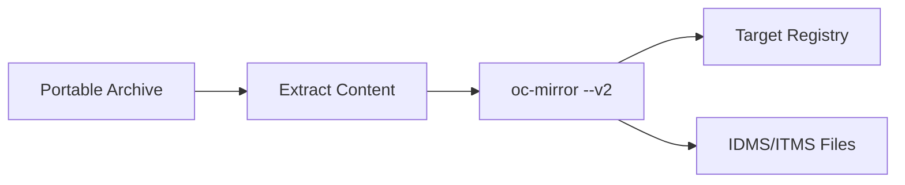

# From-Disk-to-Registry Flow

**oc-mirror --v2 Flow Pattern**

## Overview

The **from-disk-to-registry** flow uploads previously mirrored content from portable archives to a target registry in a disconnected environment. This is the second stage of the air-gapped mirroring process, deploying content that was packaged using the [mirror-to-disk.md](mirror-to-disk.md) flow.

## Use Cases

- **Air-gapped registry population** - Deploy content from portable archives
- **Disconnected mirror setup** - Initialize registries in isolated environments  
- **Content deployment** - Install pre-packaged OpenShift content bundles
- **Disaster recovery** - Restore registry content from backup archives
- **Multi-site distribution** - Deploy standardized content to multiple locations

## Flow Pattern



## Prerequisites

### System Requirements (Disconnected Host)
- **Linux System:** RHEL 9+, CentOS Stream, or compatible distribution
- **Storage:** 100+ GB available disk space for content extraction and caching
- **Memory:** 8+ GB RAM recommended for upload operations
- **Container Runtime:** Podman 4.0+ installed and configured
- **Network:** Access to target mirror registry (local network only)

### Required Components
- **Mirror Registry:** Running Quay or compatible container registry
- **Portable Archive:** Content archive from mirror-to-disk flow
- **oc-mirror:** OpenShift mirroring tool v2 (same version as mirror-to-disk)
- **Registry Authentication:** Valid credentials for target registry

### Registry Requirements
- **Running mirror registry** (see [mirror registry setup](../setup/oc-mirror-workflow.md#mirror-registry-setup))
- **Registry accessible** from disconnected host
- **Sufficient storage** for mirrored content (50+ GB)
- **Valid TLS certificates** (or registry configured for HTTP)

## Content Transfer Process

### 1. Transfer Archive to Disconnected Environment

Using your organization's approved air-gap transfer method:

```bash
# Example: Physical media transfer
# - Copy oc-mirror-content-YYYYMMDD-HHMM.tar.gz to removable media
# - Transport to disconnected environment  
# - Copy archive to disconnected host

# Verify archive integrity
sha256sum -c oc-mirror-content-YYYYMMDD-HHMM.sha256
```

### 2. Extract Content Archive

```bash
# Navigate to working directory
cd ~/oc-mirror-hackathon/oc-mirror-master/

# Extract content archive
tar -xzf /path/to/oc-mirror-content-YYYYMMDD-HHMM.tar.gz

# Verify extraction
ls -la content/
ls -la content/working-dir/
```

**Extracted Components:**
- **content/working-dir/** - Essential metadata and Cincinnati graph data
- **content/images/** - OpenShift release images and manifests  
- **content/cluster-resources/** - IDMS/ITMS files for cluster installation

## Step-by-Step Procedure

### 3. Verify Registry Connectivity

```bash
# Test registry connectivity
podman login $(hostname):8443

# Verify registry is accessible
curl -k https://$(hostname):8443/health/instance
```

### 4. Execute From-Disk-to-Registry Upload

```bash
# Upload content to registry using tested script
./oc-mirror-from-disk-to-registry.sh
```

**This command:**
- Reads content from the extracted `content/` directory
- Uploads all mirrored images to your target registry
- Creates fresh local cache as needed (cache NOT transferred)
- Generates installation resource files (IDMS/ITMS manifests)
- Preserves all essential metadata for cluster installation

### 5. Monitor Upload Progress

Upload typically takes 10-30 minutes depending on content size:

```bash
# Monitor upload progress
tail -f ~/.oc-mirror/logs/oc-mirror.log

# Check registry content growth  
# (If using Quay web interface)
firefox https://$(hostname):8443
```

### 6. Verify Upload Success

```bash
# Check final content verification
ls -la content/working-dir/cluster-resources/

# Verify IDMS and ITMS files were generated
cat content/working-dir/cluster-resources/idms-oc-mirror.yaml
cat content/working-dir/cluster-resources/itms-oc-mirror.yaml
```

**Expected Output:**
> 📄 Look for these success messages:
> ```
> [INFO]   : 📄 Generating IDMS file...
> [INFO]   : content/working-dir/cluster-resources/idms-oc-mirror.yaml file created
> [INFO]   : 📄 Generating ITMS file...
> [INFO]   : content/working-dir/cluster-resources/itms-oc-mirror.yaml file created
> ```

## What Gets Created

| Component | Purpose | Location |
|-----------|---------|----------|
| **Registry Content** | OpenShift release images uploaded to registry | Target Registry |
| **IDMS File** | ImageDigestMirrorSet for cluster installation | `content/working-dir/cluster-resources/` |
| **ITMS File** | ImageTagMirrorSet for cluster installation | `content/working-dir/cluster-resources/` |  
| **Local Cache** | Performance optimization (created fresh) | `.cache/` |
| **Cincinnati Data** | Upgrade graph metadata | `content/working-dir/` |

## Registry Verification

### 7. Validate Registry Content

```bash
# List repositories in registry (if using Quay)
curl -k https://$(hostname):8443/api/v1/repository | jq '.'

# Test pulling a specific image
podman pull --tls-verify=false $(hostname):8443/openshift/release-images:4.19.2-x86_64

# Verify cluster resource files
grep -A 5 "mirrors:" content/working-dir/cluster-resources/idms-oc-mirror.yaml
```

## Configuration Files for OpenShift Installation

The generated configuration files are required for disconnected OpenShift installation:

### ImageDigestMirrorSet (IDMS)
```bash
# Apply during cluster installation
cp content/working-dir/cluster-resources/idms-oc-mirror.yaml ~/openshift-install/
```

### ImageTagMirrorSet (ITMS)  
```bash
# Apply during cluster installation  
cp content/working-dir/cluster-resources/itms-oc-mirror.yaml ~/openshift-install/
```

## Troubleshooting

### Common Issues

**Registry connection failures:**
```bash
# Verify registry is running
podman ps | grep quay

# Check registry logs
podman logs quay-app

# Test with curl
curl -k https://$(hostname):8443/health/instance
```

**Authentication errors:**
```bash
# Re-authenticate with registry
podman login $(hostname):8443

# Verify stored credentials
podman login --get-login $(hostname):8443
```

**Upload failures:**
```bash
# Check disk space on registry host
df -h /opt/quay/

# Verify content directory integrity
find content/ -name "*.json" | wc -l

# Re-run upload with verbose logging
oc-mirror -c imageset-config.yaml --from file://content docker://$(hostname):8443 --v2 --verbose
```

### Performance Optimization

**Large content uploads:**
- Monitor network bandwidth during upload
- Consider uploading during off-peak hours
- Ensure sufficient storage on registry host

**Registry optimization:**
- Configure registry garbage collection
- Monitor registry storage usage
- Implement registry health checks

## Next Steps

After successful from-disk-to-registry completion:

1. **Use generated IDMS/ITMS files** for OpenShift cluster installation
2. **Follow [OpenShift installation guide](../guides/openshift-create-cluster.md)** using mirrored content
3. **Configure cluster** to use mirror registry for ongoing operations

## Cache Management

### Understanding Cache Behavior

**Important:** The `.cache/` directory from the mirror-to-disk flow is NOT transferred:

- **Cache is recreated** on the disconnected host during upload
- **Cache improves performance** for subsequent operations
- **Cache can be safely deleted** after upload completes
- **Cache is NOT required** for OpenShift cluster installation

```bash
# Optional: Clean up cache after upload
rm -rf .cache/
```

## References

- **Related Scripts:** `oc-mirror-master/oc-mirror-from-disk-to-registry.sh` (tested implementation)
- **Prerequisites:** [mirror-to-disk.md](mirror-to-disk.md) (complementary download flow)
- **Registry Setup:** [../setup/oc-mirror-workflow.md](../setup/oc-mirror-workflow.md#mirror-registry-setup)
- **Cluster Installation:** [../guides/openshift-create-cluster.md](../guides/openshift-create-cluster.md)
