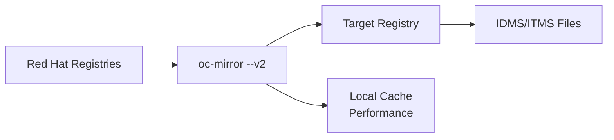

# Mirror-to-Registry Flow

**oc-mirror --v2 Flow Pattern**

## Overview

The **mirror-to-mirror** flow performs direct registry-to-registry mirroring without intermediate disk storage. This single-step process is ideal for semi-connected environments with reliable network connectivity to both Red Hat registries and your target mirror registry.

## Use Cases

- **Semi-connected environments** - Direct mirroring with controlled external connectivity
- **Registry synchronization** - Keep multiple registries in sync
- **Real-time mirroring** - Immediate content availability without storage delays
- **Simplified workflows** - Single-step mirroring process
- **Development environments** - Quick setup for testing and development
- **Continuous mirroring** - Regular content updates with automation

## Flow Pattern



## Prerequisites

### Network Requirements
- **Outbound internet access** to Red Hat registries:
  - `registry.redhat.io` (OpenShift images)
  - `quay.io/openshift-release-dev` (Release content)
  - `registry.redhat.io/redhat/redhat-operator-index` (Operators)
- **Target registry connectivity** on local network
- **Sufficient bandwidth** for continuous transfer (10+ Mbps recommended)
- **Stable network connection** (interruptions require restart)

### System Requirements
- **Linux System:** RHEL 9+, CentOS Stream, or compatible distribution
- **Storage:** 100+ GB available disk space for local cache
- **Memory:** 8+ GB RAM recommended for concurrent operations
- **Container Runtime:** Podman 4.0+ installed and configured

### Required Components
- **Mirror Registry:** Running Quay or compatible container registry
- **oc-mirror:** OpenShift mirroring tool v2
- **Red Hat Pull Secret:** Valid authentication for Red Hat registries
- **Registry Authentication:** Valid credentials for target registry

## Configuration

### ImageSet Configuration

Use the same `imageset-config.yaml` as other flows:

```yaml
kind: ImageSetConfiguration
apiVersion: mirror.openshift.io/v1alpha2
# archiveSize: 8 # only used in mirror-to-disk flow 
mirror:
  platform:
    channels:
    - name: stable-4.19
      minVersion: 4.19.2
      maxVersion: 4.19.2 
    graph: true
  operators:
    - catalog: registry.redhat.io/redhat/redhat-operator-index:v4.19
      packages:
        - name: web-terminal
  additionalImages: 
    - name: registry.redhat.io/ubi9/ubi:latest
```

**Key Considerations for Direct Mirroring:**
- **archiveSize** - Not used but still required in configuration
- **graph: true** - Essential for upgrade capabilities
- **Bandwidth impact** - All content downloads and uploads in real-time

---

## System Preparation

### Prerequisites Setup

Before starting, ensure your Linux system has:

```bash
# Install required packages (RHEL/CentOS)
sudo dnf install -y podman git jq vim wget curl

# Verify installations
podman --version
git --version
```

#### Set System Hostname
```bash
# Set a proper hostname for your system (replace with your desired hostname)
sudo hostnamectl set-hostname mirror-registry.example.com

# Verify hostname is set
hostname
```

#### Configure Local Firewall
Configure the firewall to allow inbound access to the registry:

```bash
# Allow HTTP traffic (port 80)
sudo firewall-cmd --permanent --add-port=80/tcp

# Allow HTTPS traffic (port 443)  
sudo firewall-cmd --permanent --add-port=443/tcp

# Allow mirror registry traffic (port 8443)
sudo firewall-cmd --permanent --add-port=8443/tcp

# Reload firewall to apply changes
sudo firewall-cmd --reload

# Verify firewall rules
sudo firewall-cmd --list-ports
```

> 🛡️ **Security Note:** These firewall rules allow access from any source. In production environments, restrict access to specific IP ranges using `--source=IP_RANGE/CIDR` instead of opening ports globally.

## OpenShift Tools Installation

### 1. Clone Repository

```bash
# Clone the hackathon repository
git clone https://github.com/RedHatGov/oc-mirror-hackathon.git
cd oc-mirror-hackathon
```

### 2. Download OpenShift Binaries

Execute the simplified collection script:

```bash
# Edit the OpenShift version if needed (default is "stable")
# Edit line 14 in collect_ocp: OPENSHIFT_VERSION="4.19.2" 

# Run the collection script
./collect_ocp
```

**This script downloads and installs:**
- 🔧 **oc-mirror** - Content mirroring tool for disconnected OpenShift installations
- 🛠️ **openshift-install** - OpenShift cluster installer (version-specific)
- 💻 **oc** - OpenShift command-line interface
- 🗃️ **mirror-registry** - Local Quay container registry
- ⚙️ **butane** - Machine configuration generation tool

**For disconnected installations:**

1. Copy the entire `downloads/` directory to your disconnected environment
2. Run `cd downloads && ./install.sh` to install all tools

### 2.5. Hackathon-Specific oc-mirror v2 (OpenShift 4.20.0-ec.5)

**For exact hackathon version consistency**, upgrade to oc-mirror v2 from 4.20.0-ec.5:

```bash
# After running collect_ocp, get the hackathon-specific oc-mirror v2
cd downloads/

# Download oc-mirror v2 from OpenShift 4.20.0-ec.5
echo "🔄 Downloading hackathon-specific oc-mirror v2..."
curl -L -o oc-mirror-hackathon.rhel9.tar.gz \
  "https://mirror.openshift.com/pub/openshift-v4/clients/ocp-dev-preview/4.20.0-ec.5/oc-mirror.rhel9.tar.gz"

# Backup the existing oc-mirror (optional)
mv oc-mirror oc-mirror-stable-backup 2>/dev/null || true

# Extract and install hackathon oc-mirror
tar -xzf oc-mirror-hackathon.rhel9.tar.gz
chmod +x oc-mirror

# Install to PATH
sudo cp oc-mirror /usr/local/bin/
```

> **💡 Hackathon Tip:** This ensures all participants use the exact same oc-mirror v2 version for consistent results and troubleshooting.

### 3. Verify Installation

Confirm all tools are properly installed and accessible:

```bash
# Check oc-mirror
oc-mirror help

# Verify hackathon version (4.20.0-ec.5)
oc-mirror --version

# Check OpenShift CLI
oc version

# Check installer (Note: the installer is specific for a release image)
openshift-install version

# Check butane
butane --help
```

## Mirror Registry Setup

### 1. Install Mirror Registry

Navigate to the mirror registry directory and run the installer:

```bash
# Change to mirror registry directory
cd ~/oc-mirror-hackathon/downloads/mirror-registry

# Install mirror registry
./mirror-registry install 
```

> 📝 **Critical:** When the installation completes, **save the generated registry credentials** (username and password) from the last line of the log output to a secure location. You'll need these for authentication.

### 2. Trust Registry SSL Certificate

Configure the bastion to trust the registry's self-signed certificate:

```bash
# Copy certificate to system trust store
sudo cp ~/quay-install/quay-rootCA/rootCA.pem /etc/pki/ca-trust/source/anchors/

# Update certificate trust
sudo update-ca-trust

# Verify certificate is trusted
curl -I https://$(hostname):8443
```

### 3. Configure Authentication

#### Download Red Hat Pull Secret
1. **Navigate to:** [OpenShift Downloads](https://console.redhat.com/openshift/downloads)
2. **Copy your pull secret**
3. **Use the below commands to paste the pull secret in your bastion**

#### Set Up Container Authentication
```bash
# Create container config directory
mkdir -p ~/.config/containers

# Create auth.json file with your Red Hat pull secret
vi ~/.config/containers/auth.json
# Paste your pull secret content into this auth.json file

# Login to your mirror registry (use credentials from installation)
podman login https://$(hostname):8443 \
  --username init \
  --password [YOUR_REGISTRY_PASSWORD] \
  --authfile ~/.config/containers/auth.json
```

### 4. Verify Registry Access

Test registry access via web browser:
- **Navigate to your registry URL:** e.g. `https://<YOUR-MIRROR-REGISTRY-HOSTNAME>:8443`
- **Login with your credentials** from the installation
- **Verify the registry interface loads**

---

## Step-by-Step Procedure

### 1. Verify Prerequisites

```bash
# Navigate to working directory
cd ~/oc-mirror-hackathon/oc-mirror-master/

# Test connectivity to Red Hat registries
podman login registry.redhat.io

# Test connectivity to target registry
podman login $(hostname):8443

# Verify oc-mirror is available
oc-mirror --help
```

### 2. Execute Direct Mirror-to-Mirror

> **⚠️ IMPORTANT:** Before running mirror-to-mirror, you must temporarily **comment out the graph configuration** in your `imageset-config.yaml` file. The direct mirror-to-mirror flow currently has issues when `graph: true` is enabled.
>
> ```bash
> # Edit imageset-config.yaml and comment out the graph line:
> # graph: true  # <- Comment this out for mirror-to-mirror flow
> ```
> 
> **This is a known limitation that will be addressed in future oc-mirror versions.**

```bash
# Execute direct registry-to-registry mirroring 
./oc-mirror-to-mirror.sh
```

**Option: Manual Direct Command**
```bash
# Direct mirroring command (for advanced users)
oc-mirror -c imageset-config.yaml docker://$(hostname):8443 --v2 --cache-dir .cache
```

### 3. Monitor Progress

Direct mirroring typically takes 20-60 minutes depending on content and bandwidth:

```bash
# Monitor progress in real-time
tail -f ~/.oc-mirror/logs/oc-mirror.log

# Check cache growth (performance optimization)
watch -n 60 "du -sh .cache/"

# Monitor registry content (if using Quay web interface)
firefox https://$(hostname):8443
```

**Progress Indicators:**
- Download phase: Content pulled from Red Hat registries
- Upload phase: Content pushed to target registry
- Resource generation: IDMS/ITMS manifest creation

### 4. Verify Success

```bash
# Verify registry content
curl -k https://$(hostname):8443/api/v1/repository | jq '.repositories[].name' | grep openshift

# Test pulling a mirrored image
podman pull --tls-verify=false $(hostname):8443/openshift/release-images:4.19.2-x86_64

# Check generated cluster resources
ls -la content/working-dir/cluster-resources/
```

## What Gets Created

| Component | Purpose | Location |
|-----------|---------|----------|
| **Registry Content** | OpenShift images directly uploaded | Target Registry |
| **Local Cache** | Performance optimization for future operations | `.cache/` |
| **IDMS File** | ImageDigestMirrorSet for cluster installation | `content/working-dir/cluster-resources/` |
| **ITMS File** | ImageTagMirrorSet for cluster installation | `content/working-dir/cluster-resources/` |
| **Cincinnati Data** | Upgrade graph metadata | `content/working-dir/` |

## Advantages vs Disk-Based Flows

### Benefits
✅ **Single-step process** - No intermediate archive creation  
✅ **Immediate availability** - Content ready for use upon completion  
✅ **Reduced storage requirements** - No large archive files  
✅ **Real-time progress** - Live monitoring of upload progress  
✅ **Simpler workflow** - Fewer steps and potential failure points  

### Trade-offs
⚠️ **Network dependency** - Requires stable internet throughout process  
⚠️ **No portable archives** - Cannot distribute to multiple disconnected sites  
⚠️ **Restart on failure** - Network interruptions require full restart  
⚠️ **Bandwidth intensive** - Continuous high bandwidth usage  

## Performance Optimization

For comprehensive performance tuning guidance:
**➡️ [oc-mirror Performance Tuning Reference](../reference/oc-mirror-v2-commands.md#performance-tuning)**

**Quick performance tips for registry-to-registry mirroring:**
- Use `--parallel-images` flag for faster mirroring
- Configure `--retry-times` for unstable networks
- Monitor bandwidth usage during operations

---

## Cache Management

For comprehensive cache management guidance:
**➡️ [oc-mirror Cache Management Reference](../reference/cache-management.md)**

**Quick cache tips for registry-to-registry mirroring:**
- Cache is created automatically at `.cache/`
- Monitor size: `du -sh .cache/`  
- Clean if needed: See reference guide for safe cleanup procedures

---

## Troubleshooting

For comprehensive troubleshooting guidance:
**➡️ [oc-mirror v2 Troubleshooting Reference](../reference/oc-mirror-v2-commands.md#troubleshooting)**  
**➡️ [Cache-Specific Issues](../reference/cache-management.md#troubleshooting)**

**Quick debugging for mirror-to-mirror:**
```bash
# Test connectivity to target registry
curl -k https://$(hostname):8443/health/instance

# Use verbose logging
oc-mirror -c imageset-config.yaml docker://$(hostname):8443 --v2 --verbose
```

## When to Use This Flow

### Choose Mirror-to-Registry When:
- ✅ **Semi-connected environment** with reliable internet
- ✅ **Single target registry** deployment
- ✅ **Real-time content needs** for immediate deployment
- ✅ **Sufficient bandwidth** for continuous operations
- ✅ **Development/testing** environments

### Choose Disk-Based Flows When:
- ❌ **Air-gapped environments** with no internet connectivity
- ❌ **Multiple disconnected sites** requiring content distribution
- ❌ **Unreliable network** connections
- ❌ **Bandwidth constraints** requiring scheduled transfers
- ❌ **Compliance requirements** for offline content validation

## Next Steps

🎉 **Mirror-to-Registry Complete!** Your content is now available at `https://$(hostname):8443`

### **🚀 Deploy OpenShift Cluster**

**➡️ [OpenShift Cluster Creation Guide](../guides/openshift-create-cluster.md)**

This guide will walk you through:
- ✅ **Using your mirrored registry** as the image source
- ✅ **Applying generated IDMS/ITMS** cluster resources  
- ✅ **Installing OpenShift** with disconnected content
- ✅ **Verifying cluster functionality** with mirrored images

### **🔄 Ongoing Operations**

Once your cluster is deployed:
- **Set up automated mirroring** for content updates
- **Configure monitoring** for registry health  
- **Plan upgrade workflows** using additional mirrored versions

## References

### **oc-mirror Flow Patterns**
- **Alternative Flows:** [mirror-to-disk.md](mirror-to-disk.md) and [disk-to-mirror.md](disk-to-mirror.md)
- **Image Deletion Flow:** [delete.md](delete.md)
- **Flow Decision Guide:** [README.md](README.md)

### **Next Steps**
- **OpenShift Cluster Creation:** [../guides/openshift-create-cluster.md](../guides/openshift-create-cluster.md)
- **Cluster Upgrade Guide:** [../guides/cluster-upgrade.md](../guides/cluster-upgrade.md)

### **Technical References**
- **oc-mirror v2 Commands & Troubleshooting:** [../reference/oc-mirror-v2-commands.md](../reference/oc-mirror-v2-commands.md)
- **Cache Management Guide:** [../reference/cache-management.md](../reference/cache-management.md)
- **Performance Tuning:** [../reference/oc-mirror-v2-commands.md#performance-tuning](../reference/oc-mirror-v2-commands.md#performance-tuning)

### **Setup & Infrastructure**
- **AWS Lab Infrastructure:** [../setup/aws-lab-infrastructure.md](../setup/aws-lab-infrastructure.md)
- **Complete oc-mirror Workflow:** [../reference/oc-mirror-workflow.md](../reference/oc-mirror-workflow.md)
