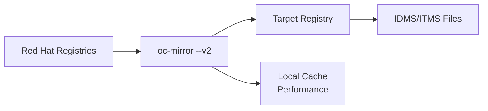

# Mirror-to-Registry Flow

**oc-mirror --v2 Flow Pattern**

## Overview

The **mirror-to-registry** flow performs direct registry-to-registry mirroring without intermediate disk storage. This single-step process is ideal for semi-connected environments with reliable network connectivity to both Red Hat registries and your target mirror registry.

## Use Cases

- **Semi-connected environments** - Direct mirroring with controlled external connectivity
- **Registry synchronization** - Keep multiple registries in sync
- **Real-time mirroring** - Immediate content availability without storage delays
- **Simplified workflows** - Single-step mirroring process
- **Development environments** - Quick setup for testing and development
- **Continuous mirroring** - Regular content updates with automation

## Flow Pattern



## Prerequisites

### Network Requirements
- **Outbound internet access** to Red Hat registries:
  - `registry.redhat.io` (OpenShift images)
  - `quay.io/openshift-release-dev` (Release content)
  - `registry.redhat.io/redhat/redhat-operator-index` (Operators)
- **Target registry connectivity** on local network
- **Sufficient bandwidth** for continuous transfer (10+ Mbps recommended)
- **Stable network connection** (interruptions require restart)

### System Requirements
- **Linux System:** RHEL 9+, CentOS Stream, or compatible distribution
- **Storage:** 100+ GB available disk space for local cache
- **Memory:** 8+ GB RAM recommended for concurrent operations
- **Container Runtime:** Podman 4.0+ installed and configured

### Required Components
- **Mirror Registry:** Running Quay or compatible container registry
- **oc-mirror:** OpenShift mirroring tool v2
- **Red Hat Pull Secret:** Valid authentication for Red Hat registries
- **Registry Authentication:** Valid credentials for target registry

## Configuration

### ImageSet Configuration

Use the same `imageset-config.yaml` as other flows:

```yaml
kind: ImageSetConfiguration
apiVersion: mirror.openshift.io/v1alpha2
archiveSize: 8  # Not used in direct mirroring but required
mirror:
  platform:
    channels:
    - name: stable-4.19
      minVersion: 4.19.2
      maxVersion: 4.19.10 
    graph: true
  operators:
    - catalog: registry.redhat.io/redhat/redhat-operator-index:v4.19
      packages:
        - name: web-terminal
        - name: cluster-logging
        - name: compliance-operator
  additionalImages: 
    - name: registry.redhat.io/ubi9/ubi:latest
```

**Key Considerations for Direct Mirroring:**
- **archiveSize** - Not used but still required in configuration
- **graph: true** - Essential for upgrade capabilities
- **Bandwidth impact** - All content downloads and uploads in real-time

## Step-by-Step Procedure

### 1. Verify Prerequisites

```bash
# Navigate to working directory
cd ~/oc-mirror-hackathon/oc-mirror-master/

# Test connectivity to Red Hat registries
podman login registry.redhat.io

# Test connectivity to target registry
podman login $(hostname):8443

# Verify oc-mirror is available
oc-mirror --help
```

### 2. Execute Direct Mirror-to-Registry

**Option A: Using Tested Script (Recommended)**
```bash
# Execute direct mirroring using tested script
# Note: This combines mirror-to-disk + upload in one operation
./oc-mirror-to-disk.sh && ./oc-mirror-from-disk-to-registry.sh
```

**Option B: Single Direct Command**
```bash
# Direct mirroring command (bypasses disk storage)
oc-mirror -c imageset-config.yaml docker://$(hostname):8443 --v2 --cache-dir .cache
```

### 3. Monitor Progress

Direct mirroring typically takes 20-60 minutes depending on content and bandwidth:

```bash
# Monitor progress in real-time
tail -f ~/.oc-mirror/logs/oc-mirror.log

# Check cache growth (performance optimization)
watch -n 60 "du -sh .cache/"

# Monitor registry content (if using Quay web interface)
firefox https://$(hostname):8443
```

**Progress Indicators:**
- Download phase: Content pulled from Red Hat registries
- Upload phase: Content pushed to target registry
- Resource generation: IDMS/ITMS manifest creation

### 4. Verify Success

```bash
# Verify registry content
curl -k https://$(hostname):8443/api/v1/repository | jq '.repositories[].name' | grep openshift

# Test pulling a mirrored image
podman pull --tls-verify=false $(hostname):8443/openshift/release-images:4.19.2-x86_64

# Check generated cluster resources
ls -la content/working-dir/cluster-resources/
```

## What Gets Created

| Component | Purpose | Location |
|-----------|---------|----------|
| **Registry Content** | OpenShift images directly uploaded | Target Registry |
| **Local Cache** | Performance optimization for future operations | `.cache/` |
| **IDMS File** | ImageDigestMirrorSet for cluster installation | `content/working-dir/cluster-resources/` |
| **ITMS File** | ImageTagMirrorSet for cluster installation | `content/working-dir/cluster-resources/` |
| **Cincinnati Data** | Upgrade graph metadata | `content/working-dir/` |

## Advantages vs Disk-Based Flows

### Benefits
✅ **Single-step process** - No intermediate archive creation  
✅ **Immediate availability** - Content ready for use upon completion  
✅ **Reduced storage requirements** - No large archive files  
✅ **Real-time progress** - Live monitoring of upload progress  
✅ **Simpler workflow** - Fewer steps and potential failure points  

### Trade-offs
⚠️ **Network dependency** - Requires stable internet throughout process  
⚠️ **No portable archives** - Cannot distribute to multiple disconnected sites  
⚠️ **Restart on failure** - Network interruptions require full restart  
⚠️ **Bandwidth intensive** - Continuous high bandwidth usage  

## Performance Optimization

### Network Optimization
```bash
# Use parallel operations for faster mirroring
oc-mirror -c imageset-config.yaml docker://$(hostname):8443 --v2 --parallel=4

# Configure retry settings for unstable networks
oc-mirror -c imageset-config.yaml docker://$(hostname):8443 --v2 --max-retry=5
```

### Cache Management
```bash
# Pre-warm cache for faster subsequent operations
mkdir -p .cache

# Monitor cache efficiency
du -sh .cache/ && echo "Cache utilization for performance"
```

## Troubleshooting

### Network Issues

**Connection timeouts:**
```bash
# Test Red Hat registry connectivity
curl -I https://registry.redhat.io/v2/

# Test target registry connectivity
curl -k https://$(hostname):8443/health/instance

# Use verbose logging for diagnostics
oc-mirror -c imageset-config.yaml docker://$(hostname):8443 --v2 --verbose
```

**Authentication failures:**
```bash
# Re-authenticate with Red Hat registries
podman login registry.redhat.io

# Re-authenticate with target registry
podman login $(hostname):8443

# Verify pull secret is current
cat ~/.docker/config.json | jq '.auths'
```

### Performance Issues

**Slow mirroring:**
```bash
# Check bandwidth utilization
iftop -i eth0

# Monitor registry performance
podman stats quay-app

# Use fewer parallel operations if system is overloaded
oc-mirror -c imageset-config.yaml docker://$(hostname):8443 --v2 --parallel=2
```

## When to Use This Flow

### Choose Mirror-to-Registry When:
- ✅ **Semi-connected environment** with reliable internet
- ✅ **Single target registry** deployment
- ✅ **Real-time content needs** for immediate deployment
- ✅ **Sufficient bandwidth** for continuous operations
- ✅ **Development/testing** environments

### Choose Disk-Based Flows When:
- ❌ **Air-gapped environments** with no internet connectivity
- ❌ **Multiple disconnected sites** requiring content distribution
- ❌ **Unreliable network** connections
- ❌ **Bandwidth constraints** requiring scheduled transfers
- ❌ **Compliance requirements** for offline content validation

## Next Steps

After successful mirror-to-registry completion:

1. **Use generated IDMS/ITMS files** for OpenShift cluster installation
2. **Follow [OpenShift installation guide](../guides/openshift-create-cluster.md)** using mirrored content
3. **Set up automated mirroring** for ongoing content updates
4. **Configure monitoring** for registry health and content freshness

## Automation Considerations

### Scheduled Mirroring
```bash
# Example: Daily content updates via cron
# 0 2 * * * cd /home/user/oc-mirror-hackathon/oc-mirror-master && ./oc-mirror-to-registry.sh
```

### Integration with CI/CD
- Trigger mirroring before OpenShift deployments
- Validate registry content as part of deployment pipelines
- Monitor content freshness for security updates

## References

- **Alternative Flows:** [mirror-to-disk.md](mirror-to-disk.md) and [from-disk-to-registry.md](from-disk-to-registry.md)
- **Registry Setup:** [../setup/oc-mirror-workflow.md](../setup/oc-mirror-workflow.md#mirror-registry-setup)
- **Cluster Installation:** [../guides/openshift-create-cluster.md](../guides/openshift-create-cluster.md)
- **Complete Workflow:** [../setup/oc-mirror-workflow.md](../setup/oc-mirror-workflow.md)
