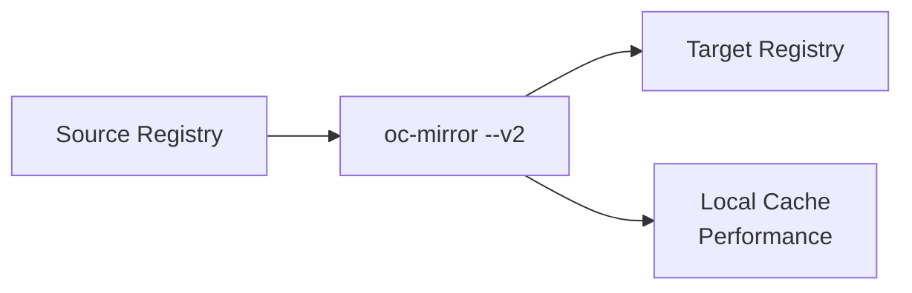

# Mirror-to-Registry Flow

**oc-mirror --v2 Flow Pattern**

## Overview

The **mirror-to-registry** flow performs direct registry-to-registry mirroring without intermediate disk storage. This is ideal for semi-connected environments with reliable network connectivity to both source and target registries.

## Use Cases

- **Semi-connected environments** - Direct mirroring with external connectivity
- **Registry synchronization** - Keep multiple registries in sync
- **Real-time mirroring** - Immediate content availability
- **Simplified workflows** - Single-step mirroring process

## Flow Pattern



## Key Commands

```bash
# Basic mirror-to-registry operation  
oc-mirror -c imageset-config.yaml docker://registry.example.com:8443 --v2

# With explicit cache management
oc-mirror -c imageset-config.yaml docker://$(hostname):8443 --v2 --cache-dir .cache
```

## What Happens

- **Downloads** content from external registries
- **Uploads** directly to target registry
- **Creates** local cache for performance
- **Maintains** metadata and manifests

## Network Requirements

- **Outbound access** to source registries (registry.redhat.io, quay.io)
- **Target registry** connectivity
- **Sufficient bandwidth** for direct transfer

---

## 🚧 **Under Development for Hackathon**

This flow documentation is currently being developed for the oc-mirror hackathon.

**Coming Soon:**
- Step-by-step procedures
- Network configuration requirements
- Performance optimization tips
- Comparison with disk-based flows

**See Also:** 
- [mirror-to-disk.md](mirror-to-disk.md) for air-gapped environments
- [from-disk-to-registry.md](from-disk-to-registry.md) for the two-step approach
