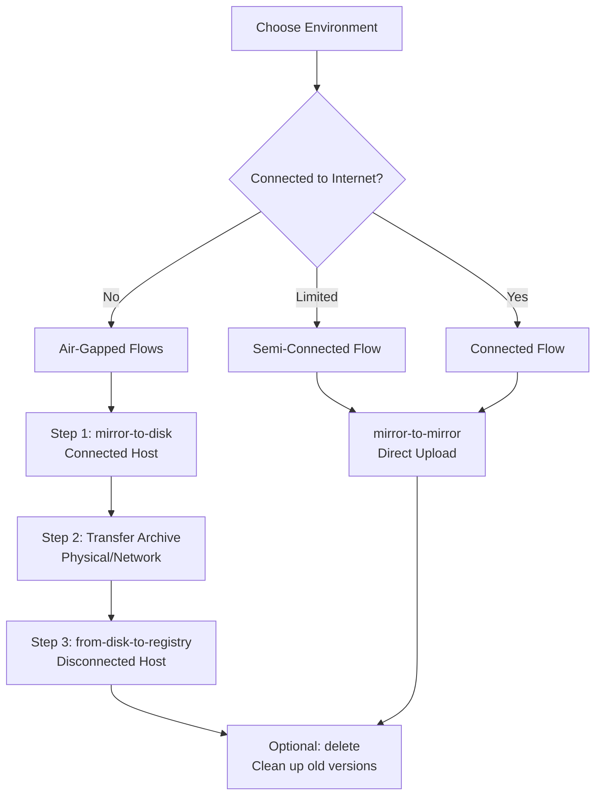

# 🚀 oc-mirror Hackathon Quick Start Guide

**Your Complete Guide to OpenShift Disconnected Mirroring**

Welcome to the oc-mirror hackathon! This guide will take you from zero to successfully running OpenShift content mirroring in disconnected environments.

---

## 🎯 Choose Your Journey

### **🤔 What's My Environment?**

Before starting, identify your environment type to choose the right path:

| Environment | Description | Internet Access | Use Case |
|-------------|-------------|-----------------|----------|
| **🌐 Connected** | Full internet access | ✅ Yes | Development, testing, learning |
| **🔗 Semi-Connected** | Limited/controlled internet | ⚠️ Limited | Corporate networks, restricted environments |
| **🚫 Air-Gapped** | No internet access | ❌ None | High-security, classified, or isolated environments |

### **🎲 Quick Decision Matrix**

**Answer these questions to find your path:**

1. **Do you have internet access on your target environment?**
   - **Yes** → Semi-Connected or Connected Path
   - **No** → Air-Gapped Path

2. **Are you simulating a real air-gapped scenario?**
   - **Yes** → Two-Host Air-Gapped Path (Recommended for learning)
   - **No** → Single-Host Path

3. **What's your primary goal?**
   - **Learn the complete process** → Two-Host Air-Gapped Path
   - **Quick testing/development** → Semi-Connected Path  
   - **Production deployment** → Match your actual environment

---

## 🏗️ Step 1: AWS Infrastructure Setup

**⚡ Everyone starts here - set up your lab infrastructure**

### **🖥️ Infrastructure Options:**

| Option | Hosts | Cost | Use Case |
|--------|--------|------|----------|
| **Two-Host Setup** | Bastion + Registry | Higher | **Complete air-gapped learning** |
| **Single-Host Setup** | Bastion only | Lower | Quick testing and development |

### **📋 Setup Instructions:**

**➡️ Follow: [setup/aws-lab-infrastructure.md](setup/aws-lab-infrastructure.md)**

**What you'll get:**
- 🖥️ **Bastion Host:** `bastion.sandboxXXX.opentlc.com` (for connected operations)
- 🖥️ **Registry Host:** `registry.sandboxXXX.opentlc.com` (for disconnected operations) *[Two-host setup only]*
- 🔗 **DNS Configuration** for both hosts
- 🛡️ **Security Groups** with mirror registry access

### **✅ Infrastructure Ready Check:**

```bash
# Verify you can SSH to your host(s)
ssh -i ~/.ssh/your-key.pem ec2-user@bastion.sandboxXXX.opentlc.com

# If using two-host setup, verify the registry host too
ssh -i ~/.ssh/your-key.pem ec2-user@registry.sandboxXXX.opentlc.com
```

---

## 🔧 Step 1.5: Hackathon-Specific oc-mirror v2 Setup

### **🎯 Hackathon Version: OpenShift 4.20.0-ec.5**

**This hackathon uses oc-mirror v2 from OpenShift 4.20.0-ec.5 for the latest features and improvements.**

### **📦 Option A: Use collect_ocp (General Purpose)**

The repository's `collect_ocp` script downloads the latest stable release:

```bash
# Clone repository and download standard tools
git clone https://github.com/RedHatGov/oc-mirror-hackathon.git
cd oc-mirror-hackathon
./collect_ocp
```

### **📦 Option B: Hackathon-Specific oc-mirror v2**

For the **exact hackathon version**, download oc-mirror v2 directly:

```bash
# After running collect_ocp, get the hackathon-specific oc-mirror v2
cd downloads/

# Download oc-mirror v2 from OpenShift 4.20.0-ec.5
echo "🔄 Downloading hackathon-specific oc-mirror v2..."
curl -L -o oc-mirror-hackathon.rhel9.tar.gz \
  "https://mirror.openshift.com/pub/openshift-v4/clients/ocp-dev-preview/4.20.0-ec.5/oc-mirror.rhel9.tar.gz"

# Backup the existing oc-mirror (optional)
mv oc-mirror oc-mirror-stable-backup 2>/dev/null || true

# Extract and install hackathon oc-mirror
tar -xzf oc-mirror-hackathon.rhel9.tar.gz
chmod +x oc-mirror

# Verify hackathon version
./oc-mirror --version
```

### **🔍 Verification**

Confirm you have oc-mirror v2 with 4.20.0-ec.5 capabilities:

```bash
# Check version output
oc-mirror --version

# Verify v2 functionality
oc-mirror --help | grep -i "v2"
```

> **💡 Tip:** Option B ensures you're using the exact same oc-mirror version as other hackathon participants, which helps with consistent results and troubleshooting.

---

## 🔄 Step 2: Understanding oc-mirror Flows

### **🧠 Core Concept: oc-mirror --v2 Flows**

**oc-mirror --v2** supports different "flow patterns" based on your environment:



### **📚 Flow Documentation:**

Each flow has complete step-by-step documentation:

| Flow | Purpose | Documentation |
|------|---------|---------------|
| **mirror-to-disk** | Create portable archives | [flows/mirror-to-disk.md](flows/mirror-to-disk.md) |
| **from-disk-to-registry** | Deploy archives to registry | [flows/from-disk-to-registry.md](flows/from-disk-to-registry.md) |
| **mirror-to-mirror** | Direct mirroring | [flows/mirror-to-mirror.md](flows/mirror-to-mirror.md) |
| **delete** | Safe content cleanup | [flows/delete.md](flows/delete.md) |

**🔍 For complete flow overview:** [flows/README.md](flows/README.md)

---

## 🛣️ Step 3: Select Your Path

### **🌟 Path A: Two-Host Air-Gapped (Recommended for Learning)**

**Perfect for understanding the complete air-gapped workflow**

**Prerequisites:** ✅ Two-host infrastructure setup complete

**Workflow:**
1. **🖥️ On Bastion Host (Connected):**
   - Follow [flows/mirror-to-disk.md](flows/mirror-to-disk.md)
   - Creates portable archives of OpenShift content
   - Simulates the "connected side" of your organization

2. **📦 Transfer Archive:**
   - Copy archive from bastion to registry host
   - Simulates air-gap transfer (physical media, approved network)

3. **🖥️ On Registry Host (Disconnected):**
   - Follow [flows/from-disk-to-registry.md](flows/from-disk-to-registry.md)
   - Deploys content to local mirror registry
   - Simulates the "disconnected side" of your organization

**Why choose this path:**
- ✅ **Complete learning experience** - full air-gapped simulation
- ✅ **Production-ready skills** - matches real enterprise deployments
- ✅ **Two-host architecture** - proper role separation
- ✅ **Portfolio-worthy** - demonstrates advanced DevOps/platform engineering

---

### **⚡ Path B: Semi-Connected (Quick Results)**

**Perfect for quick testing and development**

**Prerequisites:** ✅ Single-host infrastructure setup complete

**Workflow:**
1. **🖥️ On Bastion Host:**
   - Follow [flows/mirror-to-mirror.md](flows/mirror-to-mirror.md)
   - Direct mirroring from Red Hat to your registry
   - Single-step process with immediate results

**Why choose this path:**
- ✅ **Fastest results** - single-step process
- ✅ **Lower complexity** - fewer components
- ✅ **Development-friendly** - quick iteration
- ✅ **Resource efficient** - single host only

---

## ✅ Step 4: Validation & Success Criteria

### **🎯 How to Know You've Succeeded**

#### **For All Paths:**

1. **✅ Mirror Registry Running:**
   ```bash
   # Registry health check
   curl -k https://$(hostname):8443/health/instance
   
   # Web interface accessible
   firefox https://$(hostname):8443
   ```

2. **✅ OpenShift Content Mirrored:**
   ```bash
   # Test pulling a mirrored image
   podman pull --tls-verify=false $(hostname):8443/openshift/release-images:4.19.2-x86_64
   ```

3. **✅ Installation Files Generated:**
   ```bash
   # IDMS and ITMS files for cluster installation
   ls -la content/working-dir/cluster-resources/
   cat content/working-dir/cluster-resources/idms-oc-mirror.yaml
   ```

#### **Path-Specific Success Criteria:**

**Path A (Two-Host Air-Gapped):**
- ✅ Archive successfully created on bastion host
- ✅ Archive successfully transferred to registry host  
- ✅ Content successfully deployed to registry from archive
- ✅ Both hosts accessible and functional

**Path B (Semi-Connected):**
- ✅ Direct mirroring completed without errors
- ✅ Content immediately available in registry
- ✅ Network connectivity stable throughout process

### **🏆 Hackathon Goals Achieved:**

- 🎯 **Infrastructure Mastery** - AWS multi-host setup
- 🎯 **oc-mirror Expertise** - Understanding of all flow patterns
- 🎯 **Air-Gap Simulation** - Real-world enterprise scenario
- 🎯 **Production Readiness** - Skills applicable to enterprise deployments

---

## 📚 Additional Resources

### **🔗 Next Steps After Success:**

1. **Deploy OpenShift Cluster:**
   - [guides/openshift-create-cluster.md](guides/openshift-create-cluster.md)

2. **Upgrade Testing:**
   - [guides/cluster-upgrade.md](guides/cluster-upgrade.md)

3. **Content Management:**
   - [flows/delete.md](flows/delete.md) - Clean up old versions

### **🆘 Troubleshooting & Support:**

- **Technical References:** [reference/](reference/)
- **Advanced Patterns:** [reference/workflows/](reference/workflows/)
- **Command Reference:** [reference/oc-mirror-v2-commands.md](reference/oc-mirror-v2-commands.md)

### **🤝 Contributing:**

Found an issue or have improvements? This is a collaborative hackathon project!

---

## 🎖️ Hackathon Badges

Track your progress through the hackathon:

- [ ] **🏗️ Infrastructure Builder** - AWS two-host setup complete
- [ ] **🔄 Flow Master** - Completed at least one oc-mirror flow  
- [ ] **🌉 Bridge Builder** - Successful air-gapped transfer
- [ ] **🖼️ Registry Operator** - Mirror registry with content deployed
- [ ] **🚀 Deployment Ready** - Generated cluster installation files
- [ ] **🧹 Content Curator** - Used delete flow for content management
- [ ] **🎯 Full Stack** - Complete air-gapped workflow (Path A)

---

**🚀 Ready to start? Choose your path above and begin your oc-mirror journey!**

*Good luck, and happy mirroring! 🎉*
