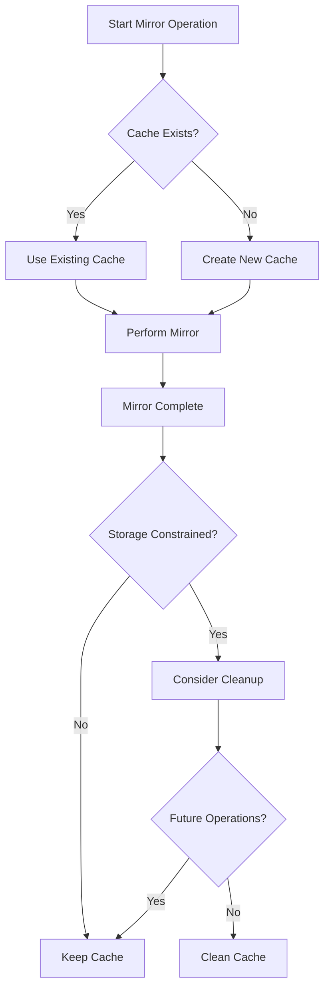

# oc-mirror v2 Cache Management Guide

A comprehensive reference for understanding, monitoring, and managing oc-mirror cache directories to optimize storage utilization and performance.

## Table of Contents

1. [Overview](#overview)
2. [Cache Architecture](#cache-architecture)
3. [Storage Considerations](#storage-considerations)
4. [Management Strategies](#management-strategies)
5. [Cleanup Operations](#cleanup-operations)
6. [Performance Impact](#performance-impact)
7. [Troubleshooting](#troubleshooting)
8. [Best Practices](#best-practices)

## Overview

oc-mirror v2 utilizes a local cache system to optimize performance and reduce bandwidth usage during mirroring operations. Understanding cache behavior is crucial for effective storage management in disconnected environments.

### Key Features
- 🚀 **Performance Optimization**: Reduces download time for repeated operations
- 💾 **Bandwidth Efficiency**: Avoids re-downloading unchanged content
- 🔄 **Operation Persistence**: Maintains state across multiple mirror sessions
- 📊 **Incremental Updates**: Only downloads changed or new content
- 🗂️ **Structured Storage**: Organized cache directory layout for troubleshooting

### Cache Behavior by Operation

| Operation | Cache Usage | Cache Modification |
|-----------|-------------|-------------------|
| **Mirror to Disk** | ✅ Read & Write | Creates/updates cache |
| **Mirror to Registry** | ✅ Read & Write | Updates cache metadata |
| **Delete (standard)** | ✅ Read | **No automatic cleanup** |
| **Delete (--force-cache-delete)** | ✅ Read & Delete | Removes cached content |

## Cache Architecture

### Default Cache Location
```bash
# Default cache directory (if --cache-dir not specified)
~/.oc-mirror/

# Recommended cache directory (explicit)
--cache-dir /path/to/dedicated/storage/.cache/
```

### Cache Directory Structure
```
.cache/
└── .oc-mirror/
    └── .cache/
        └── docker/
            └── registry/
                └── v2/
                    ├── repositories/          # Repository metadata
                    │   └── openshift/         # OpenShift-specific repos
                    ├── blobs/                 # Image layers and manifests
                    │   └── sha256/            # Content-addressable storage
                    └── _uploads/              # Temporary upload data
```

### Cache Contents
- **Image Manifests**: JSON descriptors for container images
- **Layer Blobs**: Compressed filesystem layers (largest storage component)
- **Configuration Blobs**: Container runtime configuration
- **Registry Metadata**: Repository and tag information
- **Upload Artifacts**: Temporary files during transfer operations

## Storage Considerations

### Typical Cache Sizes

| Content Type | Approximate Size | Example |
|-------------|------------------|---------|
| **Single OCP Release** | 8-12 GB | OpenShift 4.19.x |
| **Multiple OCP Versions** | 50-150 GB | 5-6 versions |
| **Full Environment** | 100-200+ GB | OCP + Operators + Additional Images |
| **Enterprise Deployment** | 500+ GB | Multiple channels, extensive operators |

### Storage Growth Patterns
```bash
# Example cache growth over time
Initial mirror (4.19.2):     ~12 GB
Add version (4.19.3):        ~18 GB  (+6 GB incremental)
Add operators:               ~35 GB  (+17 GB)
Add additional images:       ~50 GB  (+15 GB)
Multiple mirror operations:  ~65 GB  (+15 GB metadata/temp)
```

## Management Strategies

### 1. Proactive Cache Management

#### Monitor Cache Size
```bash
# Check current cache size
du -sh .cache/
du -sh ~/.oc-mirror/  # If using default location

# Monitor cache growth over time
echo "$(date): $(du -sh .cache/)" >> cache-growth.log

# Get detailed breakdown
du -h .cache/ | sort -hr | head -20
```

#### Set Dedicated Cache Directory
```bash
# Specify cache location with adequate space
oc mirror --cache-dir /opt/oc-mirror-cache/.cache [other-options]

# Set environment variable for consistent usage
export OC_MIRROR_CACHE_DIR="/opt/oc-mirror-cache/.cache"
```

### 2. Cache Lifecycle Management

#### During Active Mirroring Period
- **Keep cache intact** for optimal performance
- **Monitor storage usage** to prevent disk exhaustion
- **Use dedicated storage** with adequate capacity

#### After Mirroring Completion
- **Evaluate storage needs** vs. future performance
- **Consider cleanup** if storage is constrained
- **Document cache state** for future reference

### 3. Temporary Directory Considerations
```bash
# oc-mirror may use /tmp for temporary files
# Ensure adequate temporary space
export TMPDIR=/opt/tmp-large-storage

# Monitor temporary directory usage
df -h /tmp
df -h $TMPDIR
```

## Cleanup Operations

### 1. Manual Cache Cleanup

#### Complete Cache Removal
```bash
# Remove entire cache directory
rm -rf .cache/

# Verify removal
ls -la .cache/ 2>/dev/null || echo "Cache successfully removed"
```

#### Selective Cache Cleanup
```bash
# Remove specific repository cache
rm -rf .cache/.oc-mirror/.cache/docker/registry/v2/repositories/openshift/

# Remove blob cache (largest component)
rm -rf .cache/.oc-mirror/.cache/docker/registry/v2/blobs/

# Clean temporary uploads
rm -rf .cache/.oc-mirror/.cache/docker/registry/v2/_uploads/
```

### 2. Automated Cache Cleanup

#### Using --force-cache-delete Flag
```bash
# Delete operation with automatic cache cleanup
oc mirror delete \
    --delete-yaml-file delete-images.yaml \
    docker://registry.example.com:8443 \
    --v2 \
    --cache-dir .cache \
    --force-cache-delete
```

#### Scripted Cache Management
```bash
#!/bin/bash
# Example cache cleanup script
CACHE_DIR=".cache"
MAX_CACHE_SIZE_GB=100

current_size=$(du -s "$CACHE_DIR" 2>/dev/null | cut -f1)
current_size_gb=$((current_size / 1024 / 1024))

if [ "$current_size_gb" -gt "$MAX_CACHE_SIZE_GB" ]; then
    echo "Cache size (${current_size_gb}GB) exceeds limit (${MAX_CACHE_SIZE_GB}GB)"
    echo "Cleaning cache..."
    rm -rf "$CACHE_DIR"
fi
```

### 3. Cache Utility Scripts

Our standardized cache cleanup utility:
```bash
# Use provided cache cleanup script
./oc-mirror-cache-cleanup.sh

# Interactive cleanup with confirmation
# - Shows current cache size
# - Explains impact of cleanup
# - Confirms before deletion
```

## Performance Impact

### Cache Hit Benefits
- ⚡ **50-90% faster** mirror operations for unchanged content
- 🌐 **Reduced bandwidth** usage in constrained environments
- 🔄 **Incremental updates** only download deltas
- 📊 **Consistent performance** across repeated operations

### Cache Miss Penalties
- 🐌 **First-time slower** - cache must be rebuilt from scratch
- 💾 **Increased bandwidth** - all content downloaded again
- ⏱️ **Longer operation time** - no optimization benefits
- 🔄 **Full download cycle** - treats all content as new

### Cache Rebuild Timeline
```bash
# Typical cache rebuild performance (after cleanup)
Small environment (single OCP version):     15-30 minutes
Medium environment (multi-version + ops):   45-90 minutes  
Large environment (full enterprise):        2-4 hours
```

## Troubleshooting

### Common Cache Issues

#### 1. Cache Corruption
**Symptoms**: Unexpected mirror failures, checksum errors
```bash
# Solution: Clean and rebuild cache
rm -rf .cache/
# Next oc-mirror operation will rebuild cache
```

#### 2. Insufficient Cache Space
**Symptoms**: "No space left on device" errors
```bash
# Check cache location disk usage
df -h $(dirname $(realpath .cache/))

# Move cache to larger storage
mv .cache/ /opt/large-storage/.cache/
ln -s /opt/large-storage/.cache/ .cache
```

#### 3. Permission Issues
**Symptoms**: Access denied, permission errors
```bash
# Fix cache permissions
sudo chown -R $(whoami):$(whoami) .cache/
chmod -R u+rwX .cache/
```

#### 4. Stale Cache Data
**Symptoms**: Old content persists, update failures
```bash
# Selective cleanup of stale data
find .cache/ -name "*old-version*" -delete
# Or full cache refresh
rm -rf .cache/
```

### Diagnostic Commands

```bash
# Cache analysis
echo "Cache size: $(du -sh .cache/)"
echo "File count: $(find .cache/ -type f | wc -l)"
echo "Last modified: $(find .cache/ -type f -exec stat -c %y {} \; | sort -r | head -1)"

# Storage analysis
df -h .cache/
du -h .cache/ | sort -hr | head -20

# Performance testing
time oc mirror --config imageset-config.yaml file://test --v2 --cache-dir .cache
```

## Best Practices

### 1. Cache Directory Management

#### Location Selection
- ✅ **Use dedicated storage** with adequate capacity
- ✅ **Choose fast storage** (SSD preferred) for performance
- ✅ **Avoid home directories** which may have quotas
- ✅ **Consider network storage** for shared environments

#### Sizing Guidelines
```bash
# Recommended cache storage allocation
Small deployment:     50-100 GB
Medium deployment:    200-300 GB
Large deployment:     500+ GB
Enterprise:           1+ TB
```

### 2. Operational Practices

#### During Active Development/Testing
- **Preserve cache** for rapid iteration
- **Monitor growth** regularly
- **Use consistent cache location** across operations

#### For Production Deployments
- **Clean cache** after major milestones
- **Document cache state** in runbooks
- **Plan storage** for cache growth

#### For Disconnected Environments
- **Never transfer cache** between systems
- **Transfer only content/** directory
- **Let oc-mirror rebuild cache** on target system

### 3. Storage Lifecycle



### 4. Monitoring and Alerting

```bash
# Example monitoring script
#!/bin/bash
CACHE_DIR=".cache"
WARN_THRESHOLD_GB=80
CRITICAL_THRESHOLD_GB=95

size_gb=$(du -s "$CACHE_DIR" 2>/dev/null | awk '{print int($1/1024/1024)}')

if [ "$size_gb" -gt "$CRITICAL_THRESHOLD_GB" ]; then
    echo "CRITICAL: Cache size ${size_gb}GB exceeds ${CRITICAL_THRESHOLD_GB}GB"
elif [ "$size_gb" -gt "$WARN_THRESHOLD_GB" ]; then
    echo "WARNING: Cache size ${size_gb}GB exceeds ${WARN_THRESHOLD_GB}GB"
else
    echo "OK: Cache size ${size_gb}GB within limits"
fi
```

---

## Quick Reference Commands

```bash
# Check cache size
du -sh .cache/

# Clean entire cache
rm -rf .cache/

# Use dedicated cache directory
oc mirror --cache-dir /opt/cache/.cache [options]

# Delete with cache cleanup
oc mirror delete --force-cache-delete [options]

# Monitor cache growth
watch "du -sh .cache/"

# Cache analysis
find .cache/ -name "*.json" | wc -l  # Manifest count
find .cache/ -name "sha256:*" | wc -l  # Blob count
```

---

**💡 Remember**: Cache is a performance optimization tool. When in doubt, clean it - oc-mirror will rebuild what it needs automatically.

**⚠️ Important**: Never transfer cache directories between systems. Always transfer only the `content/` directory and let oc-mirror rebuild cache on the target system.
